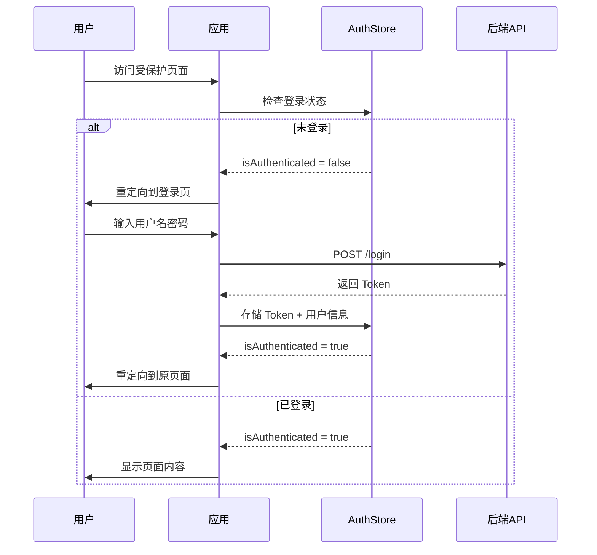
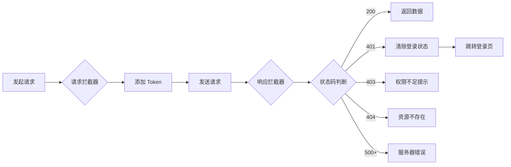

# Code Create Frontend

<div align="center">


基于 React 19 + TypeScript + Vite + Ant Design 构建的现代化前端应用模版

[快速开始](#快速开始) • [功能特性](#功能特性) • [项目结构](#项目结构) • [技术架构](#技术架构)

</div>

---

## ✨ 功能特性

### 🎯 核心功能

- **🔐 完整的认证系统** - 登录/登出、Token 管理、权限控制
- **🛣️ 智能路由管理** - 懒加载、路由守卫、404/403 页面
- **🎨 主题切换** - 支持亮色/暗色模式，持久化存储
- **📡 API 自动生成** - 基于 Orval 从 OpenAPI 自动生成 API 代码
- **🛡️ 错误边界** - 全局错误捕获，避免白屏
- **📦 状态管理** - 使用 Zustand 轻量级状态管理

### 🚀 开发体验

- **⚡ 极速开发** - Vite HMR 热更新，毫秒级响应
- **🔧 React Compiler** - 自动优化性能，减少手动优化
- **📝 TypeScript** - 完整的类型支持，提升代码质量
- **🎯 代码规范** - ESLint + Prettier 统一代码风格
- **🔄 Git Hooks** - 提交前自动检查代码质量

---

## 🎬 快速开始

```bash
# 克隆项目
git clone https://github.com/Albert-MinJie-cloud/code-create-frontend.git

# 安装依赖
npm install

# 启动开发服务器
npm run dev

# 构建生产版本
npm run build
```

### 📝 环境配置

复制环境变量文件并修改配置：

```bash
# 开发环境
cp .env.development .env.local

# 生产环境
cp .env.production .env.local
```

---

## 🏗️ 技术架构

### 技术栈

| 技术 | 版本 | 说明 |
|------|------|------|
| React | 19.2.4 | 最新版本，支持 React Compiler |
| TypeScript | 6.0 | 类型安全的 JavaScript |
| Vite | 8.0 | 下一代前端构建工具 |
| Ant Design | 6.3 | 企业级 UI 组件库 |
| React Router | 7.0 | 声明式路由管理 |
| Zustand | 5.0 | 轻量级状态管理 |
| Axios | 1.15 | HTTP 请求库 |
| Orval | 8.8 | OpenAPI 代码生成器 |

### 认证流程



### 请求拦截流程



---

## 📁 项目结构

```
src/
├── api/                    # API 接口（Orval 自动生成）
│   ├── endpoints/         # API 端点（按 controller 分类）
│   ├── models/            # TypeScript 类型定义
│   └── index.ts           # 统一导出
├── app/                   # 应用主组件
├── assets/                # 静态资源
├── components/            # 公共组件
│   ├── ErrorBoundary/    # 错误边界
│   ├── GlobalHeader/     # 全局头部
│   ├── GlobalFooter/     # 全局底部
│   ├── LoadingFallback/  # 加载中组件
│   ├── ProtectedRoute/   # 路由守卫
│   └── WithSuspense/     # Suspense 包装
├── layouts/               # 布局组件
│   └── index.tsx         # 基础布局
├── page/                  # 页面组件
│   ├── home/             # 首页
│   ├── about/            # 关于页
│   ├── dashboard/        # 仪表盘（需登录）
│   ├── login/            # 登录页
│   ├── 403/              # 权限不足
│   └── 404/              # 页面不存在
├── router/                # 路由配置
│   └── index.tsx         # 路由定义
├── store/                 # 状态管理
│   ├── authStore.ts      # 认证状态
│   └── themeStore.ts     # 主题状态
├── styles/                # 全局样式
├── utils/                 # 工具函数
│   └── request.ts        # Axios 封装
└── index.tsx              # 应用入口
```

---

## 🎯 核心功能详解

### 1. 认证系统

**登录页面** (`/login`)
- 表单验证（用户名最少3字符，密码最少5字符）
- 登录成功后自动返回原页面
- 测试账号：`admin / admin`

**Token 管理**
- 自动添加 Bearer Token 到请求头
- Token 持久化到 localStorage
- Token 过期自动登出

**权限控制**
```typescript
// 需要登录
<ProtectedRoute>
  <Dashboard />
</ProtectedRoute>

// 需要特定角色
<ProtectedRoute requiredRole="admin">
  <AdminPage />
</ProtectedRoute>
```

### 2. 路由管理

**懒加载**
```typescript
const Home = WithSuspense(lazy(() => import('@/page/home')))
```

**路由守卫**
- 未登录 → 跳转登录页
- 权限不足 → 跳转 403 页面
- 路由不存在 → 跳转 404 页面

### 3. API 自动生成

**配置 Orval** (`orval.config.ts`)
```typescript
export default defineConfig({
  CodeCreate: {
    input: {
      target: 'http://localhost:8123/api/v3/api-docs',
    },
    output: {
      target: './src/api/endpoints',
      schemas: './src/api/models',
    },
  },
})
```

**生成 API 代码**
```bash
npm run api
```

**使用 API**
```typescript
import { healthCheck } from '@/api'

const data = await healthCheck()
```

### 4. 主题切换

```typescript
const { themeStore, toggleTheme } = useThemeStore()

// 切换主题
toggleTheme()

// 当前主题
console.log(themeStore) // 'light' | 'dark'
```

---

## 📝 开发命令

```bash
# 启动开发服务器（支持热更新）
npm run dev

# 构建生产版本（先进行 TypeScript 类型检查）
npm run build

# 运行代码检查
npm run lint

# 格式化代码
npm run format

# 检查代码格式（不修改文件）
npm run format:check

# 预览生产构建
npm run preview

# 生成 API 代码
npm run api
```

---

## 🎨 代码规范

### ESLint

- TypeScript ESLint 推荐规则
- React Hooks 规则
- React Refresh 规则（Vite）
- Prettier 规则（避免冲突）

### Prettier

```json
{
  "semi": false,
  "singleQuote": true,
  "tabWidth": 2,
  "trailingComma": "es5",
  "printWidth": 80,
  "arrowParens": "avoid"
}
```

---

## 🔧 配置说明

### TypeScript 配置

项目使用 TypeScript 项目引用：
- `tsconfig.app.json` - 应用代码配置
- `tsconfig.node.json` - Vite 配置和 Node.js 工具配置

严格的代码检查：
- `noUnusedLocals` - 禁止未使用的局部变量
- `noUnusedParameters` - 禁止未使用的参数
- `noFallthroughCasesInSwitch` - 禁止 switch 语句贯穿

### 环境变量

**开发环境** (`.env.development`)
```bash
VITE_API_BASE_URL=http://localhost:8123/api
```

**生产环境** (`.env.production`)
```bash
VITE_API_BASE_URL=https://api.yourdomain.com
```

---

## 📚 最佳实践

### 1. 组件开发

```typescript
// ✅ 推荐：使用函数组件
export default function MyComponent() {
  return <div>Hello</div>
}

// ❌ 避免：使用类组件
export default class MyComponent extends Component {
  render() {
    return <div>Hello</div>
  }
}
```

### 2. 状态管理

```typescript
// ✅ 推荐：使用 Zustand
const useStore = create(set => ({
  count: 0,
  increment: () => set(state => ({ count: state.count + 1 })),
}))

// ❌ 避免：过度使用 Context
const CountContext = createContext()
```

### 3. 路由定义

```typescript
// ✅ 推荐：使用懒加载
const Home = WithSuspense(lazy(() => import('@/page/home')))

// ❌ 避免：直接导入
import Home from '@/page/home'
```

---

## 🤝 贡献指南

欢迎提交 Issue 和 Pull Request！

1. Fork 本仓库
2. 创建特性分支 (`git checkout -b feature/AmazingFeature`)
3. 提交改动 (`git commit -m 'Add some AmazingFeature'`)
4. 推送到分支 (`git push origin feature/AmazingFeature`)
5. 提交 Pull Request

---

## 📄 License

[MIT](LICENSE)

---

## 🙏 致谢

- [React](https://react.dev/)
- [Vite](https://vitejs.dev/)
- [Ant Design](https://ant.design/)
- [Zustand](https://github.com/pmndrs/zustand)
- [Orval](https://orval.dev/)

---

<div align="center">

**⭐ 如果这个项目对你有帮助，请给一个 Star！**

Made with ❤️ by [Albert-MinJie-cloud](https://github.com/Albert-MinJie-cloud)

</div>

