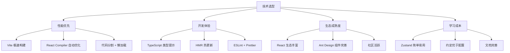
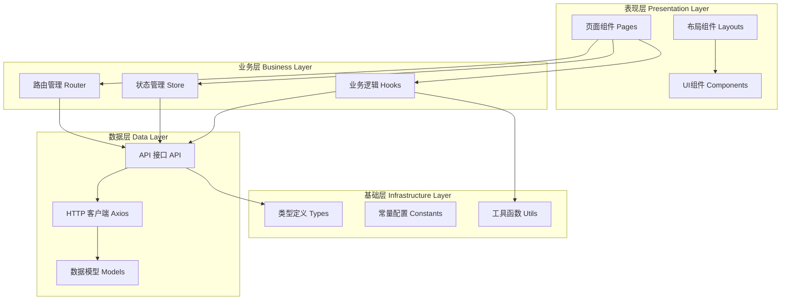
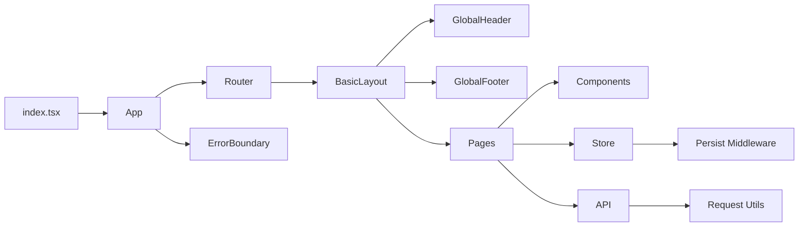
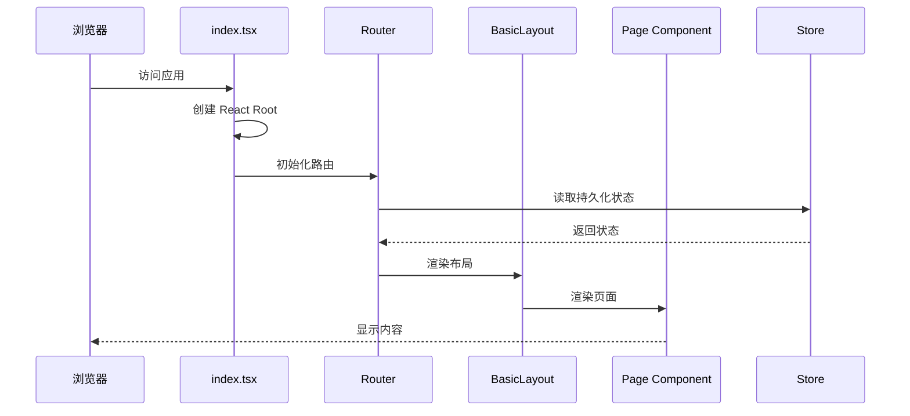
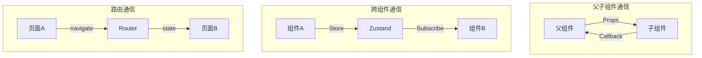
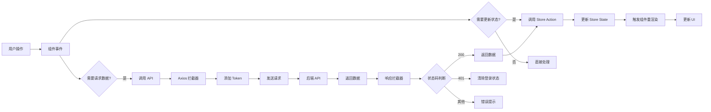
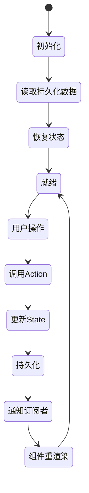
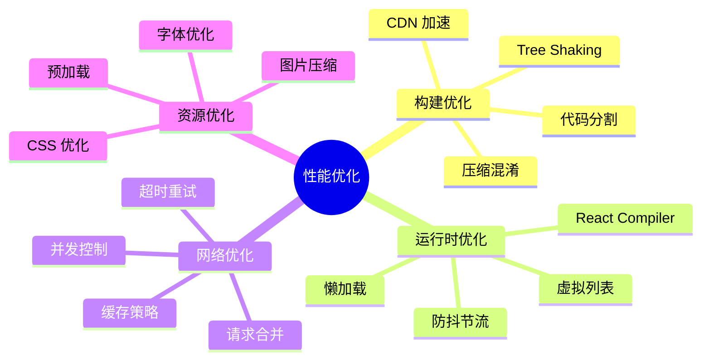
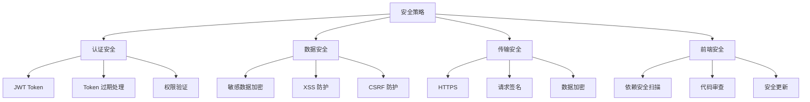

# 架构设计文档

## 📋 目录

- [1. 项目概述](#1-项目概述)
- [2. 技术选型](#2-技术选型)
- [3. 整体架构](#3-整体架构)
- [4. 目录结构](#4-目录结构)
- [5. 技术架构图](#5-技术架构图)
- [6. 数据流向](#6-数据流向)

---

## 1. 项目概述

### 1.1 项目定位

Code Create Frontend 是一个现代化的 React 前端应用模版，旨在为开发者提供一个开箱即用的项目脚手架。

**核心特性：**
- 🚀 基于最新技术栈（React 19 + TypeScript 6 + Vite 8）
- 🔐 完整的认证授权系统
- 🛣️ 智能路由管理（懒加载 + 路由守卫）
- 📡 API 自动生成（Orval + OpenAPI）
- 🎨 主题切换（亮色/暗色模式）
- 📦 轻量级状态管理（Zustand）

### 1.2 适用场景

- ✅ 中后台管理系统
- ✅ SaaS 应用前端
- ✅ 企业级 Web 应用
- ✅ 需要快速启动的项目

---

## 2. 技术选型

### 2.1 技术栈对比

| 技术领域 | 选型 | 版本 | 替代方案 | 选择理由 |
|---------|------|------|---------|---------|
| **UI 框架** | React | 19.2.4 | Vue, Angular | 生态成熟，React Compiler 自动优化 |
| **类型系统** | TypeScript | 6.0 | JavaScript | 类型安全，提升代码质量 |
| **构建工具** | Vite | 8.0 | Webpack, Rollup | 极速开发体验，HMR 毫秒级 |
| **UI 组件库** | Ant Design | 6.3 | Material-UI, Chakra UI | 企业级，组件丰富，中文友好 |
| **路由管理** | React Router | 7.0 | TanStack Router | 成熟稳定，社区活跃 |
| **状态管理** | Zustand | 5.0 | Redux, MobX | 轻量简洁，学习成本低 |
| **HTTP 客户端** | Axios | 1.15 | Fetch API | 拦截器强大，易于封装 |
| **API 生成** | Orval | 8.8 | OpenAPI Generator | 专为前端设计，生成代码质量高 |
| **代码规范** | ESLint + Prettier | - | TSLint | 社区标准，配置灵活 |

### 2.2 技术选型原则



---

## 3. 整体架构

### 3.1 分层架构



### 3.2 模块依赖关系



---

## 4. 目录结构

### 4.1 完整目录树

```
code-create-frontend/
├── public/                 # 静态资源
│   └── vite.svg           # 网站图标
├── src/                   # 源代码目录
│   ├── api/              # API 接口（自动生成）
│   │   ├── endpoints/    # API 端点
│   │   │   └── health-controller/
│   │   │       └── health-controller.ts
│   │   ├── models/       # 数据模型
│   │   │   ├── index.ts
│   │   │   └── baseResponseString.ts
│   │   └── index.ts      # 统一导出
│   ├── app/              # 应用主组件
│   │   └── index.tsx
│   ├── assets/           # 静态资源
│   │   └── react.svg
│   ├── components/       # 公共组件
│   │   ├── ErrorBoundary/      # 错误边界
│   │   │   └── index.tsx
│   │   ├── GlobalFooter/       # 全局底部
│   │   │   ├── index.tsx
│   │   │   └── index.module.css
│   │   ├── GlobalHeader/       # 全局头部
│   │   │   ├── index.tsx
│   │   │   └── index.module.css
│   │   ├── LoadingFallback/    # 加载中组件
│   │   │   └── index.tsx
│   │   ├── ProtectedRoute/     # 路由守卫
│   │   │   └── index.tsx
│   │   └── WithSuspense/       # Suspense 包装
│   │       └── index.tsx
│   ├── layouts/          # 布局组件
│   │   └── index.tsx     # 基础布局
│   ├── page/             # 页面组件
│   │   ├── 403/          # 权限不足页
│   │   │   └── index.tsx
│   │   ├── 404/          # 页面不存在
│   │   │   └── index.tsx
│   │   ├── about/        # 关于页
│   │   │   ├── index.tsx
│   │   │   └── index.module.css
│   │   ├── dashboard/    # 仪表盘（需登录）
│   │   │   └── index.tsx
│   │   ├── home/         # 首页
│   │   │   ├── index.tsx
│   │   │   └── index.module.css
│   │   └── login/        # 登录页
│   │       ├── index.tsx
│   │       └── index.module.css
│   ├── router/           # 路由配置
│   │   └── index.tsx
│   ├── store/            # 状态管理
│   │   ├── authStore.ts  # 认证状态
│   │   └── themeStore.ts # 主题状态
│   ├── styles/           # 全局样式
│   │   └── global.css
│   ├── utils/            # 工具函数
│   │   └── request.ts    # Axios 封装
│   ├── index.tsx         # 应用入口
│   └── vite-env.d.ts     # Vite 类型定义
├── doc/                  # 技术文档
│   ├── 01-架构设计.md
│   ├── 02-认证系统.md
│   ├── 03-路由系统.md
│   ├── 04-状态管理.md
│   ├── 05-API集成.md
│   ├── 06-开发规范.md
│   └── 07-部署指南.md
├── .env.development      # 开发环境变量
├── .env.production       # 生产环境变量
├── .gitignore           # Git 忽略文件
├── .prettierrc          # Prettier 配置
├── .prettierignore      # Prettier 忽略文件
├── eslint.config.js     # ESLint 配置
├── index.html           # HTML 模板
├── orval.config.ts      # Orval 配置
├── package.json         # 项目依赖
├── tsconfig.json        # TypeScript 配置
├── tsconfig.app.json    # 应用 TS 配置
├── tsconfig.node.json   # Node TS 配置
├── vite.config.ts       # Vite 配置
└── README.md            # 项目说明
```

### 4.2 目录职责说明

| 目录 | 职责 | 命名规范 |
|------|------|---------|
| `api/` | API 接口和数据模型（自动生成） | kebab-case |
| `components/` | 可复用的 UI 组件 | PascalCase |
| `layouts/` | 页面布局组件 | PascalCase |
| `page/` | 页面级组件 | kebab-case |
| `router/` | 路由配置 | - |
| `store/` | 全局状态管理 | camelCase + Store |
| `utils/` | 工具函数 | camelCase |
| `styles/` | 全局样式 | - |

---

## 5. 技术架构图

### 5.1 应用启动流程



### 5.2 组件通信方式



---

## 6. 数据流向

### 6.1 完整数据流



### 6.2 状态管理流程



---

## 7. 性能优化策略

### 7.1 优化措施



### 7.2 性能指标

| 指标 | 目标值 | 说明 |
|------|--------|------|
| FCP (First Contentful Paint) | < 1.5s | 首次内容绘制 |
| LCP (Largest Contentful Paint) | < 2.5s | 最大内容绘制 |
| TTI (Time to Interactive) | < 3.5s | 可交互时间 |
| Bundle Size | < 500KB | 打包体积（gzip） |

---

## 8. 安全策略

### 8.1 安全措施



---

## 9. 扩展性设计

### 9.1 可扩展点

- **路由扩展** - 支持动态路由、嵌套路由
- **组件扩展** - 组件库可替换、可定制
- **状态扩展** - Store 模块化、可插拔
- **API 扩展** - 支持多个 API 源
- **主题扩展** - 支持自定义主题
- **国际化** - 预留 i18n 接口

### 9.2 插件机制

```typescript
// 示例：插件接口设计
interface Plugin {
  name: string
  version: string
  install: (app: App) => void
  uninstall?: () => void
}

// 使用插件
app.use(myPlugin)
```

---

## 10. 总结

本项目采用现代化的技术栈和架构设计，具有以下特点：

✅ **技术先进** - 使用最新的 React 19、TypeScript 6、Vite 8  
✅ **架构清晰** - 分层明确，职责单一  
✅ **易于维护** - 代码规范，文档完善  
✅ **性能优异** - 多重优化，加载快速  
✅ **安全可靠** - 完善的安全策略  
✅ **扩展性强** - 模块化设计，易于扩展  

适合作为企业级项目的起点，也可以作为学习现代前端开发的参考。
