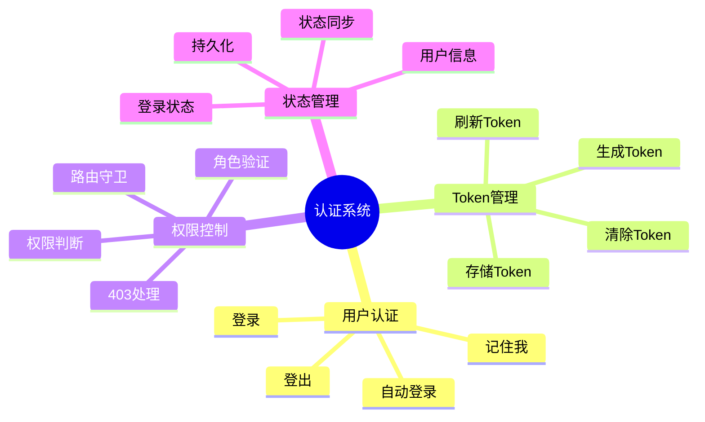
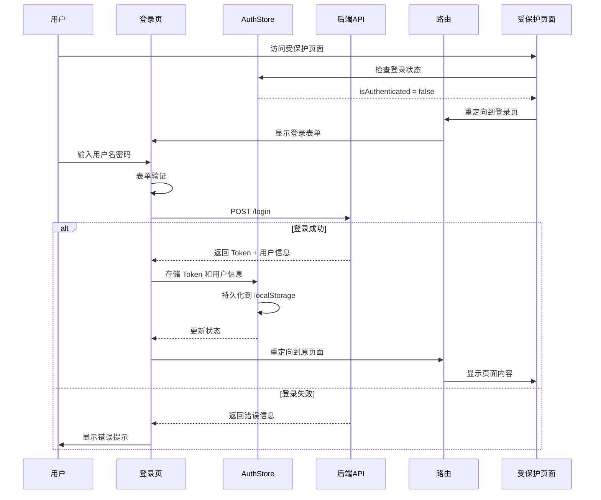
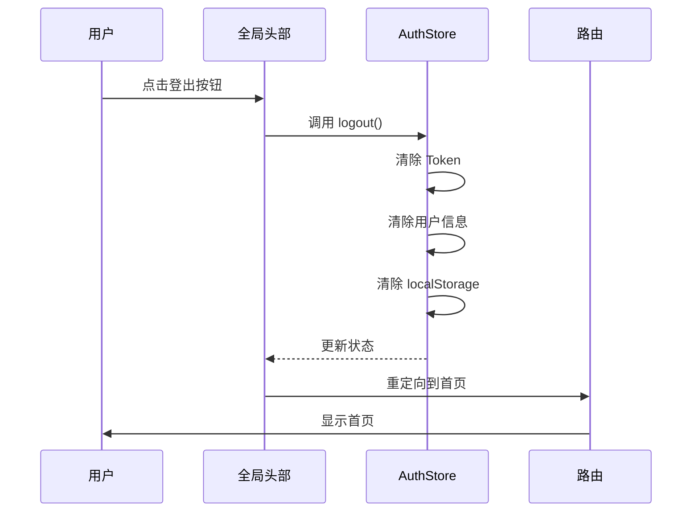
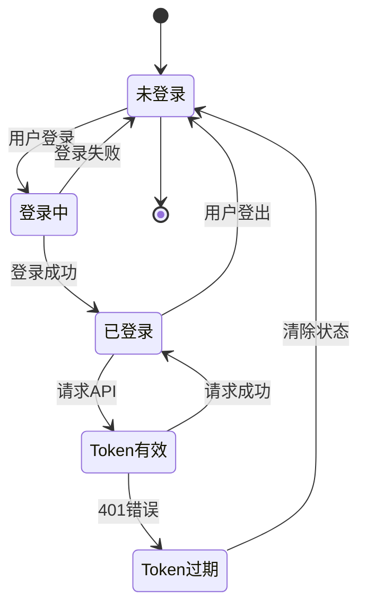
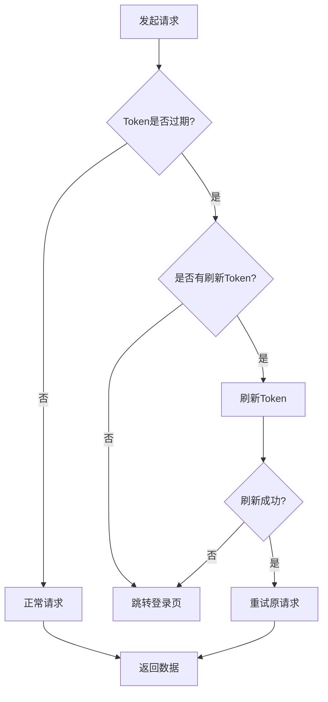
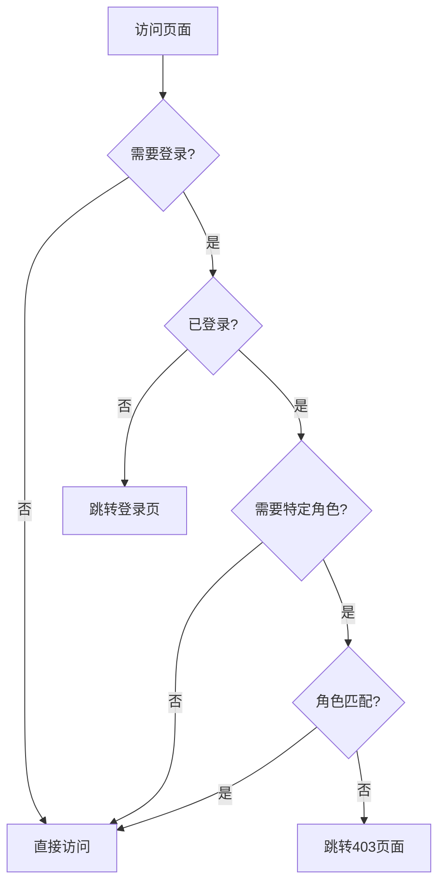
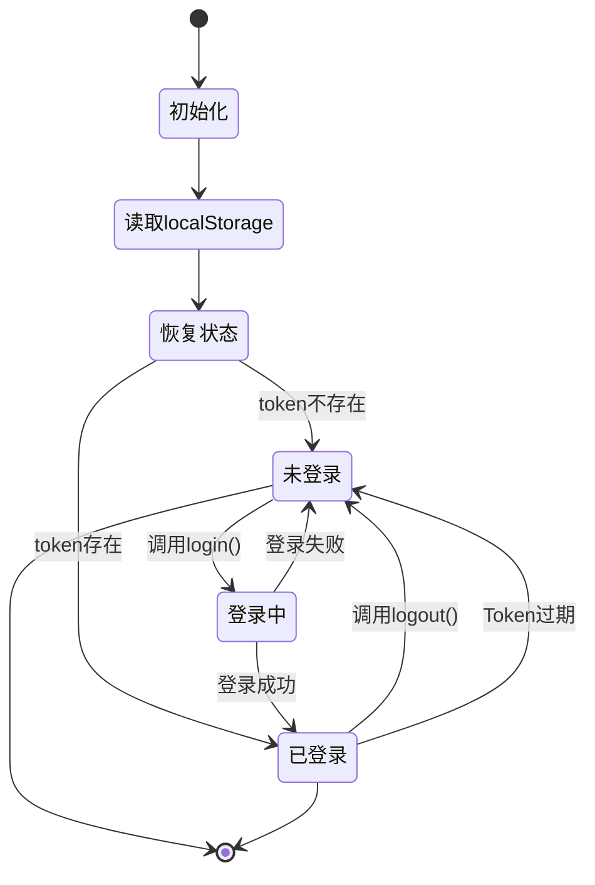
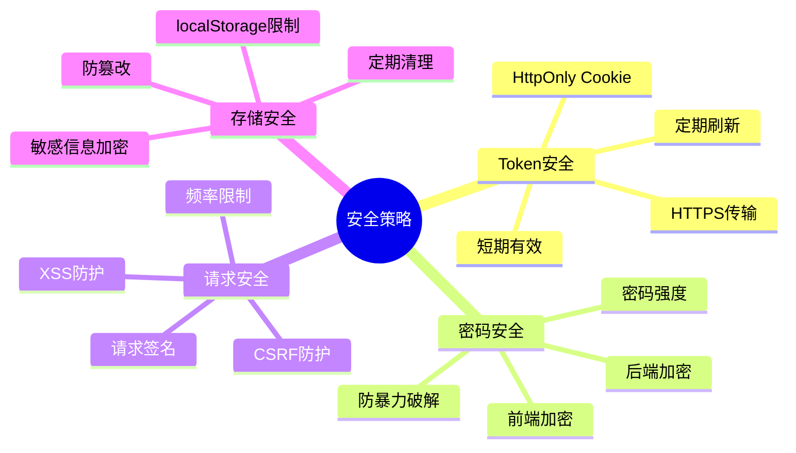

# 认证系统文档

## 📋 目录

- [1. 系统概述](#1-系统概述)
- [2. 认证流程](#2-认证流程)
- [3. Token 管理](#3-token-管理)
- [4. 权限控制](#4-权限控制)
- [5. 状态管理](#5-状态管理)
- [6. 安全策略](#6-安全策略)

---

## 1. 系统概述

### 1.1 功能特性



### 1.2 技术栈

| 技术 | 用途 | 说明 |
|------|------|------|
| Zustand | 状态管理 | 存储认证状态和用户信息 |
| localStorage | 持久化 | 保存 Token 和用户信息 |
| Axios | HTTP 请求 | 自动添加 Token 到请求头 |
| React Router | 路由守卫 | 保护需要登录的页面 |

---

## 2. 认证流程

### 2.1 完整登录流程



### 2.2 登录页面实现

**文件位置：** `src/page/login/index.tsx`

```typescript
import { useState } from 'react'
import { useNavigate, useLocation } from 'react-router-dom'
import { Form, Input, Button, Card, Checkbox, message } from 'antd'
import { UserOutlined, LockOutlined } from '@ant-design/icons'
import { useAuthStore } from '@/store/authStore'

interface LoginForm {
  username: string
  password: string
  remember: boolean
}

export default function Login() {
  const [loading, setLoading] = useState(false)
  const navigate = useNavigate()
  const location = useLocation()
  const login = useAuthStore(state => state.login)

  // 获取重定向地址
  const from = (location.state as { from?: string })?.from || '/'

  const onFinish = async (values: LoginForm) => {
    setLoading(true)
    try {
      const success = await login(values.username, values.password)
      if (success) {
        message.success('登录成功')
        navigate(from, { replace: true })
      } else {
        message.error('用户名或密码错误')
      }
    } catch (error) {
      message.error('登录失败，请稍后重试')
    } finally {
      setLoading(false)
    }
  }

  return (
    <Card title="用户登录">
      <Form onFinish={onFinish} initialValues={{ remember: true }}>
        <Form.Item
          name="username"
          rules={[
            { required: true, message: '请输入用户名' },
            { min: 3, message: '用户名至少 3 个字符' },
          ]}
        >
          <Input prefix={<UserOutlined />} placeholder="用户名" />
        </Form.Item>

        <Form.Item
          name="password"
          rules={[
            { required: true, message: '请输入密码' },
            { min: 5, message: '密码至少 5 个字符' },
          ]}
        >
          <Input.Password prefix={<LockOutlined />} placeholder="密码" />
        </Form.Item>

        <Form.Item name="remember" valuePropName="checked">
          <Checkbox>记住我</Checkbox>
        </Form.Item>

        <Form.Item>
          <Button type="primary" htmlType="submit" loading={loading} block>
            登录
          </Button>
        </Form.Item>
      </Form>
    </Card>
  )
}
```

### 2.3 登出流程



---

## 3. Token 管理

### 3.1 Token 生命周期



### 3.2 Token 存储

**AuthStore 实现：** `src/store/authStore.ts`

```typescript
import { create } from 'zustand'
import { persist } from 'zustand/middleware'

interface AuthState {
  isAuthenticated: boolean
  user: { name: string; role: string } | null
  token: string | null
  login: (username: string, password: string) => Promise<boolean>
  logout: () => void
  setToken: (token: string) => void
}

export const useAuthStore = create<AuthState>()(
  persist(
    set => ({
      isAuthenticated: false,
      user: null,
      token: null,
      
      // 登录
      login: async (username: string, password: string) => {
        // 模拟登录逻辑，实际项目中应该调用 API
        if (username === 'admin' && password === 'admin') {
          const mockToken = 'mock-jwt-token-' + Date.now()
          set({
            isAuthenticated: true,
            user: { name: 'Admin', role: 'admin' },
            token: mockToken,
          })
          return true
        }
        return false
      },
      
      // 登出
      logout: () => {
        set({ isAuthenticated: false, user: null, token: null })
      },
      
      // 设置 Token
      setToken: (token: string) => {
        set({ token })
      },
    }),
    {
      name: 'auth-storage', // localStorage key
    }
  )
)
```

### 3.3 请求拦截器

**文件位置：** `src/utils/request.ts`

```typescript
import axios from 'axios'
import { message } from 'antd'
import { useAuthStore } from '@/store/authStore'

const myAxios = axios.create({
  baseURL: import.meta.env.VITE_API_BASE_URL,
  timeout: 60000,
  withCredentials: true,
})

// 请求拦截器 - 自动添加 Token
myAxios.interceptors.request.use(
  function (config) {
    const token = useAuthStore.getState().token
    if (token) {
      config.headers.Authorization = `Bearer ${token}`
    }
    return config
  },
  function (error) {
    return Promise.reject(error)
  }
)

// 响应拦截器 - 处理 Token 过期
myAxios.interceptors.response.use(
  function (response) {
    const { data } = response

    // 未登录
    if (data.code === 40100) {
      const { logout } = useAuthStore.getState()
      logout()

      if (!window.location.pathname.includes('/login')) {
        message.warning('请先登录')
        window.location.href = `/login?redirect=${encodeURIComponent(
          window.location.pathname
        )}`
      }
    } else if (data.code !== 0 && data.code !== 200) {
      message.error(data.message || '请求失败')
    }

    return response
  },
  function (error) {
    if (error.response) {
      const status = error.response.status
      if (status === 401) {
        message.error('未授权，请重新登录')
        useAuthStore.getState().logout()
        window.location.href = '/login'
      } else if (status === 403) {
        message.error('没有权限访问')
      } else if (status === 404) {
        message.error('请求的资源不存在')
      } else if (status >= 500) {
        message.error('服务器错误，请稍后重试')
      }
    } else if (error.request) {
      message.error('网络错误，请检查网络连接')
    } else {
      message.error('请求失败')
    }

    return Promise.reject(error)
  }
)
```

### 3.4 Token 刷新策略



---

## 4. 权限控制

### 4.1 路由守卫

**文件位置：** `src/components/ProtectedRoute/index.tsx`

```typescript
import { Navigate, useLocation } from 'react-router-dom'
import { useAuthStore } from '@/store/authStore'

interface ProtectedRouteProps {
  children: React.ReactNode
  requiredRole?: string
}

function ProtectedRoute({ children, requiredRole }: ProtectedRouteProps) {
  const { isAuthenticated, user } = useAuthStore()
  const location = useLocation()

  // 未登录，重定向到登录页
  if (!isAuthenticated) {
    return <Navigate to="/login" state={{ from: location.pathname }} replace />
  }

  // 需要特定角色权限
  if (requiredRole && user?.role !== requiredRole) {
    return <Navigate to="/403" replace />
  }

  return <>{children}</>
}

export default ProtectedRoute
```

### 4.2 权限判断流程



### 4.3 路由配置示例

**文件位置：** `src/router/index.tsx`

```typescript
import { lazy } from 'react'
import { createBrowserRouter } from 'react-router-dom'
import BasicLayout from '@/layouts'
import ProtectedRoute from '@/components/ProtectedRoute'
import { WithSuspense } from '@/components/WithSuspense'

const Home = WithSuspense(lazy(() => import('@/page/home')))
const Dashboard = WithSuspense(lazy(() => import('@/page/dashboard')))
const Login = WithSuspense(lazy(() => import('@/page/login')))

const router = createBrowserRouter([
  {
    path: '/',
    element: <BasicLayout />,
    children: [
      {
        index: true,
        element: <Home />,
      },
      {
        path: 'dashboard',
        // 需要登录才能访问
        element: (
          <ProtectedRoute>
            <Dashboard />
          </ProtectedRoute>
        ),
      },
      // 需要特定角色
      // {
      //   path: 'admin',
      //   element: (
      //     <ProtectedRoute requiredRole="admin">
      //       <AdminPage />
      //     </ProtectedRoute>
      //   ),
      // },
    ],
  },
  {
    path: '/login',
    element: <Login />,
  },
])

export default router
```

### 4.4 权限矩阵

| 页面 | 路径 | 需要登录 | 需要角色 | 说明 |
|------|------|---------|---------|------|
| 首页 | `/` | ❌ | - | 公开访问 |
| 关于 | `/about` | ❌ | - | 公开访问 |
| 登录 | `/login` | ❌ | - | 登录页面 |
| 看板 | `/dashboard` | ✅ | - | 需要登录 |
| 管理后台 | `/admin` | ✅ | admin | 需要管理员角色 |
| 403 | `/403` | ❌ | - | 权限不足 |
| 404 | `*` | ❌ | - | 页面不存在 |

---

## 5. 状态管理

### 5.1 状态结构

```typescript
interface AuthState {
  // 是否已登录
  isAuthenticated: boolean
  
  // 用户信息
  user: {
    name: string      // 用户名
    role: string      // 角色
  } | null
  
  // JWT Token
  token: string | null
  
  // 登录方法
  login: (username: string, password: string) => Promise<boolean>
  
  // 登出方法
  logout: () => void
  
  // 设置 Token
  setToken: (token: string) => void
}
```

### 5.2 状态流转



### 5.3 使用示例

```typescript
// 在组件中使用
function MyComponent() {
  const { isAuthenticated, user, login, logout } = useAuthStore()
  
  // 登录
  const handleLogin = async () => {
    const success = await login('admin', 'admin')
    if (success) {
      console.log('登录成功')
    }
  }
  
  // 登出
  const handleLogout = () => {
    logout()
  }
  
  return (
    <div>
      {isAuthenticated ? (
        <div>
          <p>欢迎，{user?.name}</p>
          <button onClick={handleLogout}>登出</button>
        </div>
      ) : (
        <button onClick={handleLogin}>登录</button>
      )}
    </div>
  )
}
```

---

## 6. 安全策略

### 6.1 安全措施



### 6.2 安全检查清单

| 检查项 | 状态 | 说明 |
|--------|------|------|
| ✅ HTTPS 传输 | 已实现 | 生产环境强制 HTTPS |
| ✅ Token 过期处理 | 已实现 | 401 自动登出 |
| ✅ 权限验证 | 已实现 | 路由守卫 + 角色验证 |
| ✅ XSS 防护 | 已实现 | React 自动转义 |
| ⚠️ CSRF 防护 | 待实现 | 需要后端配合 |
| ⚠️ 密码加密 | 待实现 | 前端 RSA 加密 |
| ⚠️ Token 刷新 | 待实现 | 自动刷新机制 |

### 6.3 最佳实践

**✅ 推荐做法：**

```typescript
// 1. 使用 HTTPS
const API_BASE_URL = 'https://api.example.com'

// 2. Token 存储在 localStorage（仅开发环境）
// 生产环境建议使用 HttpOnly Cookie

// 3. 请求超时设置
axios.create({
  timeout: 60000,
})

// 4. 敏感操作二次确认
const handleDelete = () => {
  Modal.confirm({
    title: '确认删除？',
    onOk: () => deleteAPI(),
  })
}
```

**❌ 避免做法：**

```typescript
// 1. 不要在 URL 中传递 Token
const url = `/api/user?token=${token}` // ❌

// 2. 不要在控制台打印敏感信息
console.log('Token:', token) // ❌

// 3. 不要长期存储 Token
localStorage.setItem('token', token) // ⚠️ 注意过期时间

// 4. 不要忽略错误处理
await login(username, password) // ❌ 缺少 try-catch
```

---

## 7. 测试指南

### 7.1 测试场景

| 场景 | 步骤 | 预期结果 |
|------|------|---------|
| 正常登录 | 1. 输入正确的用户名密码<br>2. 点击登录 | 登录成功，跳转到原页面 |
| 登录失败 | 1. 输入错误的用户名密码<br>2. 点击登录 | 显示错误提示 |
| 未登录访问 | 1. 未登录状态<br>2. 访问 /dashboard | 跳转到登录页 |
| 权限不足 | 1. 普通用户<br>2. 访问管理员页面 | 跳转到 403 页面 |
| Token 过期 | 1. Token 过期<br>2. 发起请求 | 自动登出，跳转登录页 |
| 记住登录 | 1. 勾选"记住我"<br>2. 刷新页面 | 保持登录状态 |

### 7.2 测试账号

| 用户名 | 密码 | 角色 | 说明 |
|--------|------|------|------|
| admin | admin | admin | 管理员账号 |
| user | user | user | 普通用户 |

---

## 8. 常见问题

### Q1: 如何实现自动登录？

使用 Zustand 的 `persist` 中间件，Token 会自动保存到 localStorage，刷新页面后自动恢复登录状态。

### Q2: Token 过期后如何处理？

响应拦截器会捕获 401 错误，自动清除登录状态并跳转到登录页。

### Q3: 如何实现多角色权限？

在 `ProtectedRoute` 中传入 `requiredRole` 参数，支持角色验证。

### Q4: 如何在请求中自动添加 Token？

请求拦截器会自动从 AuthStore 读取 Token 并添加到请求头。

### Q5: 如何实现 Token 刷新？

可以在响应拦截器中判断 Token 即将过期时，自动调用刷新接口获取新 Token。

---

## 9. 总结

本认证系统具有以下特点：

✅ **完整的认证流程** - 登录、登出、Token 管理  
✅ **自动化 Token 处理** - 请求自动携带、过期自动登出  
✅ **灵活的权限控制** - 路由守卫、角色验证  
✅ **持久化存储** - 刷新页面保持登录状态  
✅ **安全可靠** - 多重安全措施  
✅ **易于扩展** - 支持多角色、多权限  

适合作为企业级应用的认证系统基础。
