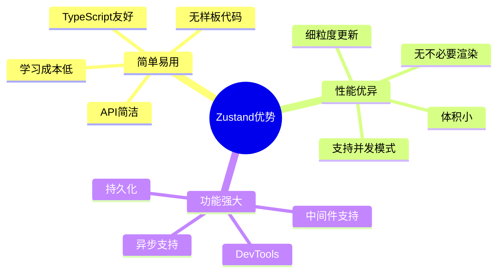
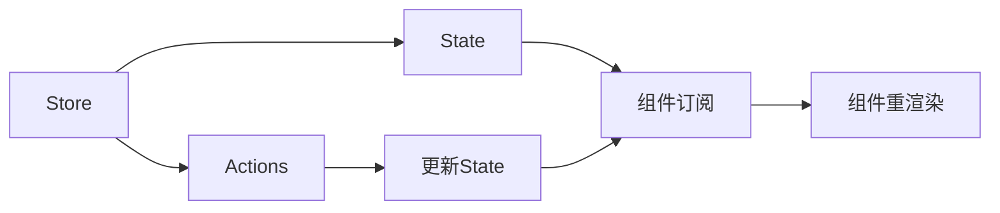
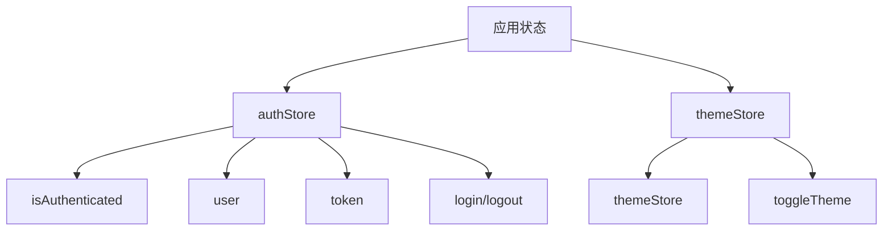
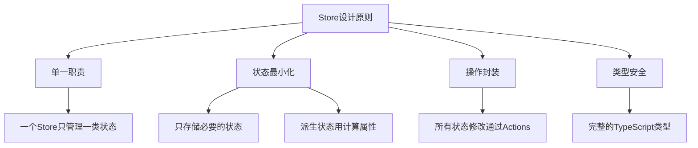
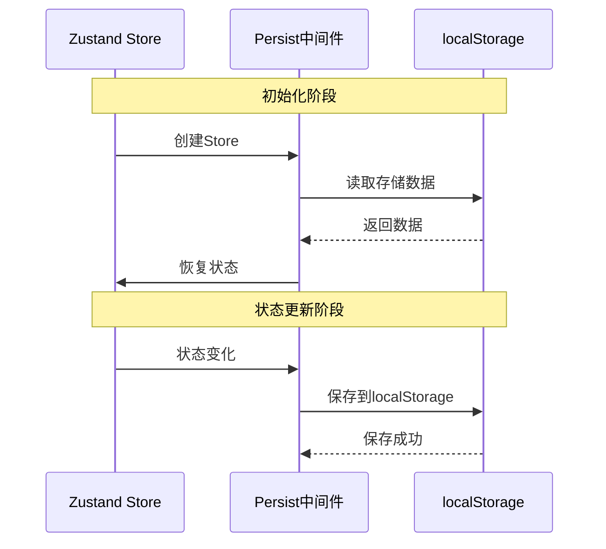
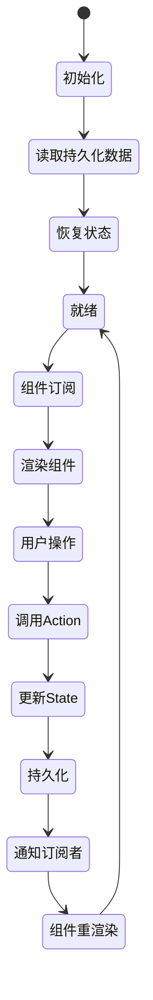
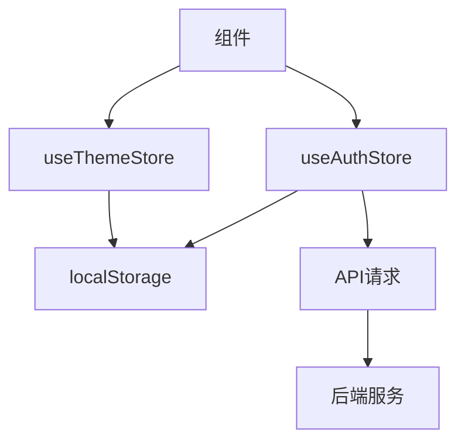

# 状态管理文档

## 📋 目录

- [1. 系统概述](#1-系统概述)
- [2. Zustand 基础](#2-zustand-基础)
- [3. Store 设计](#3-store-设计)
- [4. 持久化](#4-持久化)
- [5. 最佳实践](#5-最佳实践)

---

## 1. 系统概述

### 1.1 为什么选择 Zustand？



### 1.2 与其他方案对比

| 特性 | Zustand | Redux | MobX | Context API |
|------|---------|-------|------|-------------|
| 学习曲线 | ⭐ | ⭐⭐⭐ | ⭐⭐ | ⭐ |
| 样板代码 | 少 | 多 | 中 | 少 |
| 性能 | 优秀 | 良好 | 优秀 | 一般 |
| TypeScript | ✅ | ✅ | ✅ | ✅ |
| DevTools | ✅ | ✅ | ✅ | ❌ |
| 包体积 | 1.2KB | 8KB | 16KB | 0KB |

---

## 2. Zustand 基础

### 2.1 核心概念



### 2.2 基本用法

```typescript
import { create } from 'zustand'

// 1. 创建 Store
interface CounterState {
  count: number
  increment: () => void
  decrement: () => void
}

const useCounterStore = create<CounterState>(set => ({
  count: 0,
  increment: () => set(state => ({ count: state.count + 1 })),
  decrement: () => set(state => ({ count: state.count - 1 })),
}))

// 2. 在组件中使用
function Counter() {
  const { count, increment, decrement } = useCounterStore()
  
  return (
    <div>
      <p>Count: {count}</p>
      <button onClick={increment}>+</button>
      <button onClick={decrement}>-</button>
    </div>
  )
}

// 3. 选择性订阅（性能优化）
function CountDisplay() {
  // 只订阅 count，不订阅 actions
  const count = useCounterStore(state => state.count)
  return <p>{count}</p>
}
```

### 2.3 状态更新方式

```typescript
// 1. 直接设置
set({ count: 10 })

// 2. 基于当前状态更新
set(state => ({ count: state.count + 1 }))

// 3. 部分更新（自动合并）
set({ count: 5 }) // 只更新 count，其他状态保持不变

// 4. 替换整个状态
set(() => ({ count: 0 }), true) // 第二个参数为 true 表示替换
```

---

## 3. Store 设计

### 3.1 项目中的 Store



### 3.2 AuthStore 实现

**文件位置：** `src/store/authStore.ts`

```typescript
import { create } from 'zustand'
import { persist } from 'zustand/middleware'

interface AuthState {
  // 状态
  isAuthenticated: boolean
  user: { name: string; role: string } | null
  token: string | null
  
  // 操作
  login: (username: string, password: string) => Promise<boolean>
  logout: () => void
  setToken: (token: string) => void
}

export const useAuthStore = create<AuthState>()(
  persist(
    set => ({
      // 初始状态
      isAuthenticated: false,
      user: null,
      token: null,
      
      // 登录
      login: async (username: string, password: string) => {
        // 模拟 API 调用
        if (username === 'admin' && password === 'admin') {
          const mockToken = 'mock-jwt-token-' + Date.now()
          set({
            isAuthenticated: true,
            user: { name: 'Admin', role: 'admin' },
            token: mockToken,
          })
          return true
        }
        return false
      },
      
      // 登出
      logout: () => {
        set({ isAuthenticated: false, user: null, token: null })
      },
      
      // 设置 Token
      setToken: (token: string) => {
        set({ token })
      },
    }),
    {
      name: 'auth-storage', // localStorage key
    }
  )
)
```

### 3.3 ThemeStore 实现

**文件位置：** `src/store/themeStore.ts`

```typescript
import { create } from 'zustand'
import { persist } from 'zustand/middleware'

type Theme = 'light' | 'dark'

interface ThemeState {
  themeStore: Theme
  toggleTheme: () => void
}

export const useThemeStore = create<ThemeState>()(
  persist(
    set => ({
      themeStore: 'light',
      toggleTheme: () =>
        set(state => ({
          themeStore: state.themeStore === 'light' ? 'dark' : 'light',
        })),
    }),
    {
      name: 'theme-storage',
    }
  )
)
```

### 3.4 Store 设计原则



---

## 4. 持久化

### 4.1 持久化流程



### 4.2 持久化配置

```typescript
import { create } from 'zustand'
import { persist, createJSONStorage } from 'zustand/middleware'

interface MyState {
  count: number
  increment: () => void
}

const useStore = create<MyState>()(
  persist(
    set => ({
      count: 0,
      increment: () => set(state => ({ count: state.count + 1 })),
    }),
    {
      name: 'my-storage', // localStorage key
      
      // 自定义存储
      storage: createJSONStorage(() => localStorage),
      
      // 部分持久化
      partialize: state => ({ count: state.count }),
      
      // 版本控制
      version: 1,
      migrate: (persistedState, version) => {
        if (version === 0) {
          // 迁移逻辑
        }
        return persistedState
      },
    }
  )
)
```

### 4.3 持久化策略

| 策略 | 适用场景 | 示例 |
|------|---------|------|
| 全部持久化 | 用户偏好设置 | 主题、语言 |
| 部分持久化 | 敏感信息 | 只持久化 Token，不持久化密码 |
| 不持久化 | 临时状态 | 加载状态、错误信息 |
| 加密持久化 | 敏感数据 | 用户信息、Token |

---

## 5. 最佳实践

### 5.1 性能优化

**✅ 推荐做法：**

```typescript
// 1. 选择性订阅
function MyComponent() {
  // ✅ 只订阅需要的状态
  const count = useStore(state => state.count)
  
  // ❌ 订阅整个 store
  const store = useStore()
}

// 2. 使用 shallow 比较
import { shallow } from 'zustand/shallow'

function MyComponent() {
  const { count, name } = useStore(
    state => ({ count: state.count, name: state.name }),
    shallow
  )
}

// 3. 拆分大型 Store
// ✅ 按功能拆分
const useUserStore = create(...)
const useCartStore = create(...)

// ❌ 所有状态放在一个 Store
const useAppStore = create(...)
```

### 5.2 异步操作

```typescript
interface TodoState {
  todos: Todo[]
  loading: boolean
  error: string | null
  fetchTodos: () => Promise<void>
}

const useTodoStore = create<TodoState>(set => ({
  todos: [],
  loading: false,
  error: null,
  
  fetchTodos: async () => {
    set({ loading: true, error: null })
    try {
      const response = await fetch('/api/todos')
      const todos = await response.json()
      set({ todos, loading: false })
    } catch (error) {
      set({ error: error.message, loading: false })
    }
  },
}))
```

### 5.3 中间件使用

```typescript
import { devtools, subscribeWithSelector } from 'zustand/middleware'

// 1. DevTools 中间件
const useStore = create<State>()(
  devtools(
    set => ({
      count: 0,
      increment: () => set(state => ({ count: state.count + 1 })),
    }),
    { name: 'MyStore' }
  )
)

// 2. 订阅中间件
const useStore = create<State>()(
  subscribeWithSelector(set => ({
    count: 0,
    increment: () => set(state => ({ count: state.count + 1 })),
  }))
)

// 订阅特定状态
useStore.subscribe(
  state => state.count,
  count => console.log('Count changed:', count)
)

// 3. 组合多个中间件
const useStore = create<State>()(
  devtools(
    persist(
      subscribeWithSelector(set => ({
        // ...
      })),
      { name: 'storage' }
    ),
    { name: 'MyStore' }
  )
)
```

### 5.4 TypeScript 最佳实践

```typescript
// 1. 定义清晰的接口
interface UserState {
  user: User | null
  setUser: (user: User) => void
  clearUser: () => void
}

// 2. 使用泛型
const useStore = create<UserState>()(...)

// 3. 导出类型
export type { UserState }
export { useStore as useUserStore }

// 4. 避免类型断言
// ✅ 推荐
const user = useStore(state => state.user)

// ❌ 避免
const user = useStore(state => state.user) as User
```

### 5.5 测试

```typescript
import { renderHook, act } from '@testing-library/react'
import { useCounterStore } from './counterStore'

describe('CounterStore', () => {
  it('should increment count', () => {
    const { result } = renderHook(() => useCounterStore())
    
    act(() => {
      result.current.increment()
    })
    
    expect(result.current.count).toBe(1)
  })
  
  it('should reset count', () => {
    const { result } = renderHook(() => useCounterStore())
    
    act(() => {
      result.current.increment()
      result.current.reset()
    })
    
    expect(result.current.count).toBe(0)
  })
})
```

---

## 6. 常见问题

### Q1: 如何在 Store 外部访问状态？

```typescript
// 获取状态
const count = useCounterStore.getState().count

// 更新状态
useCounterStore.setState({ count: 10 })

// 订阅变化
const unsubscribe = useCounterStore.subscribe(
  state => console.log('State changed:', state)
)
```

### Q2: 如何重置 Store？

```typescript
interface State {
  count: number
  reset: () => void
}

const initialState = { count: 0 }

const useStore = create<State>(set => ({
  ...initialState,
  reset: () => set(initialState),
}))
```

### Q3: 如何实现计算属性？

```typescript
interface State {
  count: number
  doubleCount: number
}

const useStore = create<State>(set => ({
  count: 0,
  get doubleCount() {
    return this.count * 2
  },
}))

// 或者在组件中计算
function MyComponent() {
  const count = useStore(state => state.count)
  const doubleCount = count * 2
}
```

### Q4: 如何处理复杂的状态更新？

```typescript
// 使用 Immer 中间件
import { immer } from 'zustand/middleware/immer'

const useStore = create<State>()(
  immer(set => ({
    todos: [],
    addTodo: (todo) => set(state => {
      state.todos.push(todo) // 直接修改，Immer 会处理不可变性
    }),
  }))
)
```

---

## 7. 架构图

### 7.1 状态流转



### 7.2 Store 依赖关系



---

## 8. 总结

Zustand 作为状态管理方案具有以下优势：

✅ **简单易用** - API 简洁，学习成本低  
✅ **性能优异** - 细粒度更新，无不必要渲染  
✅ **TypeScript 友好** - 完整的类型支持  
✅ **功能强大** - 中间件、持久化、DevTools  
✅ **体积小巧** - 仅 1.2KB（gzip）  
✅ **灵活扩展** - 支持自定义中间件  

适合各种规模的 React 应用。
