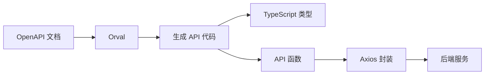
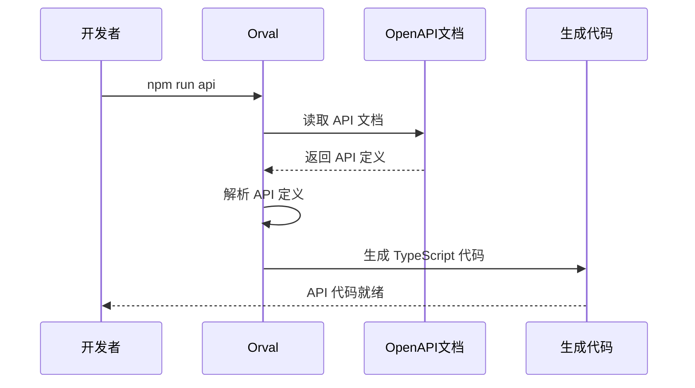
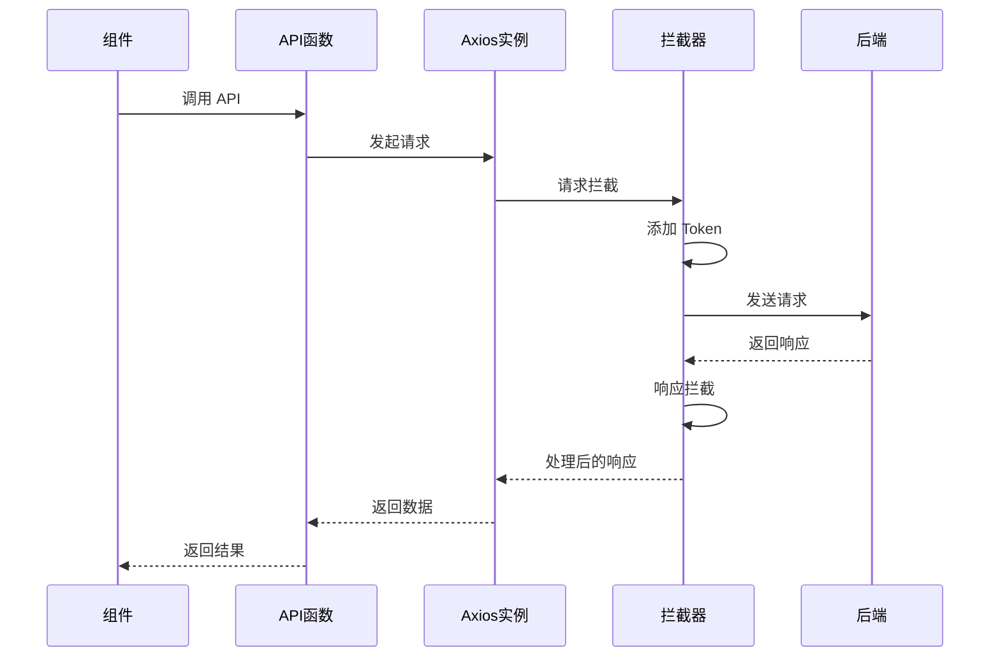

# API 集成文档

## 📋 目录

- [1. 系统概述](#1-系统概述)
- [2. Orval 配置](#2-orval-配置)
- [3. API 使用](#3-api-使用)
- [4. 请求封装](#4-请求封装)
- [5. 最佳实践](#5-最佳实践)

---

## 1. 系统概述

### 1.1 技术方案



### 1.2 技术栈

| 技术 | 版本 | 用途 |
|------|------|------|
| Orval | 8.8 | API 代码生成 |
| Axios | 1.15 | HTTP 客户端 |
| OpenAPI | 3.0 | API 规范 |

---

## 2. Orval 配置

### 2.1 配置文件

**文件位置：** `orval.config.ts`

```typescript
import { defineConfig } from 'orval'

export default defineConfig({
  CodeCreate: {
    output: {
      mode: 'tags-split',              // 按标签分割文件
      target: './src/api/endpoints',   // 输出目录
      schemas: './src/api/models',     // 类型定义目录
      formatter: 'prettier',           // 使用 Prettier 格式化
      clean: true,                     // 清理旧文件
      override: {
        mutator: {
          path: './src/utils/request.ts',  // 自定义 HTTP 客户端
          name: 'MyAxios',
        },
      },
    },
    input: {
      target: 'http://localhost:8123/api/v3/api-docs',  // OpenAPI 文档地址
    },
  },
})
```

### 2.2 生成流程



### 2.3 生成的代码结构

```
src/api/
├── endpoints/              # API 端点
│   └── health-controller/
│       └── health-controller.ts
├── models/                 # 数据模型
│   ├── index.ts
│   └── baseResponseString.ts
└── index.ts               # 统一导出
```

---

## 3. API 使用

### 3.1 生成的 API 代码

**示例：** `src/api/endpoints/health-controller/health-controller.ts`

```typescript
import type { BaseResponseString } from '../../models'
import { MyAxios } from '../../../utils/request'

export const healthCheck = () => {
  return MyAxios<BaseResponseString>({ url: `/health/`, method: 'GET' })
}

export type HealthCheckResult = NonNullable<
  Awaited<ReturnType<typeof healthCheck>>
>
```

### 3.2 在组件中使用

```typescript
import { useState, useEffect } from 'react'
import { healthCheck } from '@/api'
import { message } from 'antd'

function HealthStatus() {
  const [status, setStatus] = useState<string>('')
  const [loading, setLoading] = useState(false)

  useEffect(() => {
    const fetchStatus = async () => {
      setLoading(true)
      try {
        const result = await healthCheck()
        setStatus(result.data || 'OK')
      } catch (error) {
        message.error('获取状态失败')
      } finally {
        setLoading(false)
      }
    }

    fetchStatus()
  }, [])

  return <div>Status: {loading ? 'Loading...' : status}</div>
}
```

### 3.3 统一导出

**文件位置：** `src/api/index.ts`

```typescript
// 导出所有 endpoints
export * from './endpoints/health-controller/health-controller'

// 导出所有 models
export * from './models'
```

---

## 4. 请求封装

### 4.1 Axios 实例

**文件位置：** `src/utils/request.ts`

```typescript
import axios, { type AxiosRequestConfig } from 'axios'
import { message } from 'antd'
import { useAuthStore } from '@/store/authStore'

// 创建 Axios 实例
const myAxios = axios.create({
  baseURL: import.meta.env.VITE_API_BASE_URL || 'http://localhost:8123/api',
  timeout: 60000,
  withCredentials: true,
})

// 请求拦截器
myAxios.interceptors.request.use(
  function (config) {
    // 添加 Token
    const token = useAuthStore.getState().token
    if (token) {
      config.headers.Authorization = `Bearer ${token}`
    }
    return config
  },
  function (error) {
    return Promise.reject(error)
  }
)

// 响应拦截器
myAxios.interceptors.response.use(
  function (response) {
    const { data } = response

    // 未登录
    if (data.code === 40100) {
      const { logout } = useAuthStore.getState()
      logout()
      if (!window.location.pathname.includes('/login')) {
        message.warning('请先登录')
        window.location.href = `/login?redirect=${encodeURIComponent(
          window.location.pathname
        )}`
      }
    } else if (data.code !== 0 && data.code !== 200) {
      message.error(data.message || '请求失败')
    }

    return response
  },
  function (error) {
    if (error.response) {
      const status = error.response.status
      if (status === 401) {
        message.error('未授权，请重新登录')
        useAuthStore.getState().logout()
        window.location.href = '/login'
      } else if (status === 403) {
        message.error('没有权限访问')
      } else if (status === 404) {
        message.error('请求的资源不存在')
      } else if (status >= 500) {
        message.error('服务器错误，请稍后重试')
      }
    } else if (error.request) {
      message.error('网络错误，请检查网络连接')
    } else {
      message.error('请求失败')
    }

    return Promise.reject(error)
  }
)

// 导出封装的请求方法
export const MyAxios = <T>(config: AxiosRequestConfig): Promise<T> => {
  return myAxios(config).then(({ data }) => data)
}

export default myAxios
```

### 4.2 请求流程



---

## 5. 最佳实践

### 5.1 错误处理

```typescript
// 1. 统一错误处理
async function fetchData() {
  try {
    const data = await someAPI()
    return data
  } catch (error) {
    // 拦截器已处理，这里可以做额外处理
    console.error('API Error:', error)
    throw error
  }
}

// 2. 使用自定义 Hook
function useAPI<T>(apiFunc: () => Promise<T>) {
  const [data, setData] = useState<T | null>(null)
  const [loading, setLoading] = useState(false)
  const [error, setError] = useState<Error | null>(null)

  const execute = async () => {
    setLoading(true)
    setError(null)
    try {
      const result = await apiFunc()
      setData(result)
    } catch (err) {
      setError(err as Error)
    } finally {
      setLoading(false)
    }
  }

  return { data, loading, error, execute }
}
```

### 5.2 环境配置

```bash
# .env.development
VITE_API_BASE_URL=http://localhost:8123/api

# .env.production
VITE_API_BASE_URL=https://api.yourdomain.com
```

### 5.3 类型安全

```typescript
// ✅ 推荐：使用生成的类型
import type { User, UserListResponse } from '@/api'

const users: User[] = []
const response: UserListResponse = await getUserList()

// ❌ 避免：使用 any
const users: any = []
```

---

## 6. 常见问题

### Q1: 如何重新生成 API 代码？

```bash
npm run api
```

### Q2: 如何处理多个 API 源？

```typescript
// orval.config.ts
export default defineConfig({
  api1: {
    input: { target: 'http://api1.com/docs' },
    output: { target: './src/api/api1' },
  },
  api2: {
    input: { target: 'http://api2.com/docs' },
    output: { target: './src/api/api2' },
  },
})
```

### Q3: 如何自定义请求配置？

```typescript
// 在 API 调用时传入配置
const data = await someAPI({
  timeout: 30000,
  headers: { 'Custom-Header': 'value' },
})
```

---

## 7. 总结

本 API 集成方案具有以下特点：

✅ **自动化生成** - 从 OpenAPI 自动生成代码  
✅ **类型安全** - 完整的 TypeScript 类型  
✅ **统一封装** - Axios 拦截器统一处理  
✅ **易于维护** - API 变更只需重新生成  
✅ **开发高效** - 减少手写 API 代码  

适合快速开发和迭代。
