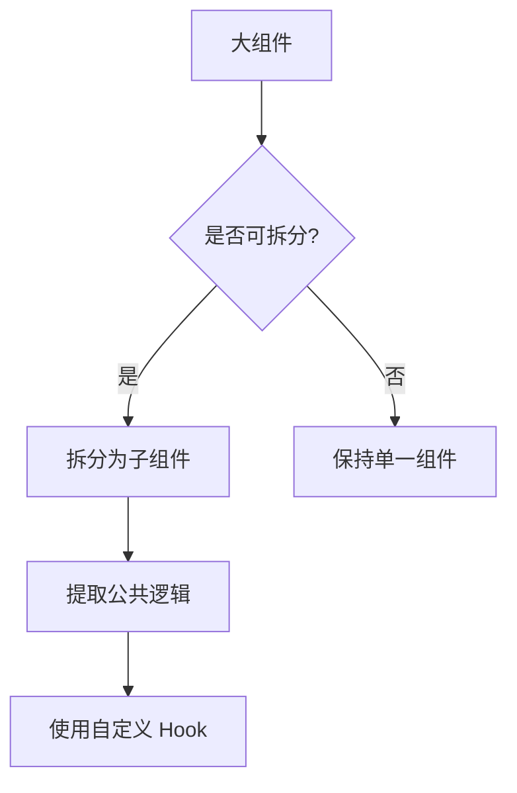
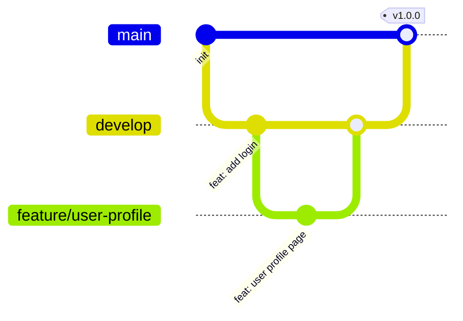

# 开发规范文档

## 📋 目录

- [1. 代码规范](#1-代码规范)
- [2. 命名规范](#2-命名规范)
- [3. 组件规范](#3-组件规范)
- [4. Git 规范](#4-git-规范)
- [5. 最佳实践](#5-最佳实践)

---

## 1. 代码规范

### 1.1 ESLint 配置

**文件位置：** `eslint.config.js`

```javascript
import js from '@eslint/js'
import globals from 'globals'
import reactHooks from 'eslint-plugin-react-hooks'
import reactRefresh from 'eslint-plugin-react-refresh'
import tseslint from 'typescript-eslint'
import prettier from 'eslint-config-prettier'

export default tseslint.config(
  { ignores: ['dist'] },
  {
    extends: [js.configs.recommended, ...tseslint.configs.recommended, prettier],
    files: ['**/*.{ts,tsx}'],
    languageOptions: {
      ecmaVersion: 2023,
      globals: globals.browser,
    },
    plugins: {
      'react-hooks': reactHooks,
      'react-refresh': reactRefresh,
    },
    rules: {
      ...reactHooks.configs.recommended.rules,
      'react-refresh/only-export-components': [
        'warn',
        { allowConstantExport: true },
      ],
    },
  }
)
```

### 1.2 Prettier 配置

**文件位置：** `.prettierrc`

```json
{
  "semi": false,
  "singleQuote": true,
  "tabWidth": 2,
  "trailingComma": "es5",
  "printWidth": 80,
  "arrowParens": "avoid"
}
```

### 1.3 代码风格

```typescript
// ✅ 推荐
export default function MyComponent() {
  const [count, setCount] = useState(0)
  
  const handleClick = () => {
    setCount(count + 1)
  }
  
  return <button onClick={handleClick}>{count}</button>
}

// ❌ 避免
export default function MyComponent() {
  const [count,setCount]=useState(0);
  const handleClick=()=>{setCount(count+1);}
  return <button onClick={handleClick}>{count}</button>;
}
```

---

## 2. 命名规范

### 2.1 命名规则

| 类型 | 规范 | 示例 |
|------|------|------|
| 组件 | PascalCase | `UserProfile`, `LoginForm` |
| 函数 | camelCase | `getUserInfo`, `handleClick` |
| 变量 | camelCase | `userName`, `isLoading` |
| 常量 | UPPER_SNAKE_CASE | `API_BASE_URL`, `MAX_COUNT` |
| 接口 | PascalCase | `UserInfo`, `ApiResponse` |
| 类型 | PascalCase | `User`, `Theme` |
| 文件夹 | kebab-case | `user-profile`, `login-form` |
| 文件 | kebab-case | `user-profile.tsx`, `index.tsx` |

### 2.2 命名示例

```typescript
// ✅ 推荐
interface UserInfo {
  name: string
  age: number
}

const API_BASE_URL = 'https://api.example.com'

function getUserInfo(userId: string): Promise<UserInfo> {
  return fetch(`${API_BASE_URL}/users/${userId}`)
}

// ❌ 避免
interface userinfo {
  name: string
  age: number
}

const apiBaseUrl = 'https://api.example.com'

function GetUserInfo(user_id: string): Promise<userinfo> {
  return fetch(`${apiBaseUrl}/users/${user_id}`)
}
```

---

## 3. 组件规范

### 3.1 组件结构

```typescript
// 1. 导入
import { useState, useEffect } from 'react'
import { Button, Card } from 'antd'
import { useAuthStore } from '@/store/authStore'
import styles from './index.module.css'

// 2. 类型定义
interface Props {
  title: string
  onSubmit: (data: FormData) => void
}

// 3. 组件定义
export default function MyComponent({ title, onSubmit }: Props) {
  // 3.1 Hooks
  const [data, setData] = useState<FormData | null>(null)
  const { user } = useAuthStore()
  
  // 3.2 副作用
  useEffect(() => {
    // ...
  }, [])
  
  // 3.3 事件处理
  const handleSubmit = () => {
    if (data) {
      onSubmit(data)
    }
  }
  
  // 3.4 渲染
  return (
    <Card title={title}>
      <Button onClick={handleSubmit}>提交</Button>
    </Card>
  )
}
```

### 3.2 组件拆分



**拆分原则：**
- 单一职责：一个组件只做一件事
- 可复用性：能被多处使用的逻辑提取出来
- 可维护性：代码行数控制在 200 行以内

---

## 4. Git 规范

### 4.1 分支管理



### 4.2 Commit 规范

**格式：** `<type>(<scope>): <subject>`

**类型（type）：**
- `feat`: 新功能
- `fix`: 修复 bug
- `docs`: 文档更新
- `style`: 代码格式（不影响代码运行）
- `refactor`: 重构
- `perf`: 性能优化
- `test`: 测试相关
- `chore`: 构建过程或辅助工具的变动

**示例：**
```bash
feat(auth): 添加登录功能
fix(router): 修复路由守卫bug
docs(readme): 更新README文档
style(button): 调整按钮样式
refactor(api): 重构API请求逻辑
perf(list): 优化列表渲染性能
test(auth): 添加登录测试用例
chore(deps): 升级依赖版本
```

### 4.3 分支命名

| 分支类型 | 命名规范 | 示例 |
|---------|---------|------|
| 主分支 | `main` | `main` |
| 开发分支 | `develop` | `develop` |
| 功能分支 | `feature/<name>` | `feature/user-login` |
| 修复分支 | `fix/<name>` | `fix/login-bug` |
| 发布分支 | `release/<version>` | `release/v1.0.0` |
| 热修复分支 | `hotfix/<name>` | `hotfix/critical-bug` |

---

## 5. 最佳实践

### 5.1 性能优化

```typescript
// ✅ 推荐：使用 React.memo
const ExpensiveComponent = React.memo(({ data }) => {
  return <div>{/* 复杂渲染 */}</div>
})

// ✅ 推荐：使用 useMemo
const sortedData = useMemo(() => {
  return data.sort((a, b) => a.value - b.value)
}, [data])

// ✅ 推荐：使用 useCallback
const handleClick = useCallback(() => {
  console.log('clicked')
}, [])

// ❌ 避免：在渲染中创建新对象
function MyComponent() {
  return <Child style={{ margin: 10 }} /> // 每次渲染都创建新对象
}
```

### 5.2 TypeScript 使用

```typescript
// ✅ 推荐：明确的类型定义
interface User {
  id: string
  name: string
  email: string
}

function getUser(id: string): Promise<User> {
  return fetch(`/api/users/${id}`).then(res => res.json())
}

// ❌ 避免：使用 any
function getUser(id: any): Promise<any> {
  return fetch(`/api/users/${id}`).then(res => res.json())
}
```

### 5.3 错误处理

```typescript
// ✅ 推荐：完整的错误处理
async function fetchData() {
  try {
    const response = await fetch('/api/data')
    if (!response.ok) {
      throw new Error(`HTTP error! status: ${response.status}`)
    }
    const data = await response.json()
    return data
  } catch (error) {
    console.error('Fetch error:', error)
    throw error
  }
}

// ❌ 避免：忽略错误
async function fetchData() {
  const response = await fetch('/api/data')
  return response.json()
}
```

### 5.4 代码注释

```typescript
// ✅ 推荐：必要的注释
/**
 * 获取用户信息
 * @param userId 用户ID
 * @returns 用户信息对象
 */
async function getUserInfo(userId: string): Promise<User> {
  // 从缓存中获取
  const cached = cache.get(userId)
  if (cached) return cached
  
  // 从API获取
  const user = await api.getUser(userId)
  cache.set(userId, user)
  return user
}

// ❌ 避免：无意义的注释
// 定义变量
const count = 0

// 加1
setCount(count + 1)
```

---

## 6. 代码审查清单

### 6.1 功能检查

- [ ] 功能是否按需求实现
- [ ] 是否有遗漏的边界情况
- [ ] 错误处理是否完善
- [ ] 是否有性能问题

### 6.2 代码质量

- [ ] 代码是否符合规范
- [ ] 命名是否清晰
- [ ] 是否有重复代码
- [ ] 是否有不必要的复杂度

### 6.3 测试

- [ ] 是否有单元测试
- [ ] 测试覆盖率是否足够
- [ ] 是否测试了边界情况

### 6.4 文档

- [ ] 是否更新了相关文档
- [ ] 复杂逻辑是否有注释
- [ ] API 变更是否有说明

---

## 7. 工具推荐

### 7.1 VS Code 插件

- ESLint
- Prettier
- TypeScript Vue Plugin (Volar)
- GitLens
- Error Lens
- Auto Rename Tag
- Path Intellisense

### 7.2 Chrome 插件

- React Developer Tools
- Redux DevTools
- Lighthouse

---

## 8. 总结

遵循开发规范可以：

✅ **提升代码质量** - 统一的代码风格  
✅ **提高可维护性** - 清晰的代码结构  
✅ **减少 Bug** - 完善的错误处理  
✅ **提升协作效率** - 统一的开发流程  
✅ **便于代码审查** - 规范的提交记录  

建议团队成员共同遵守。
