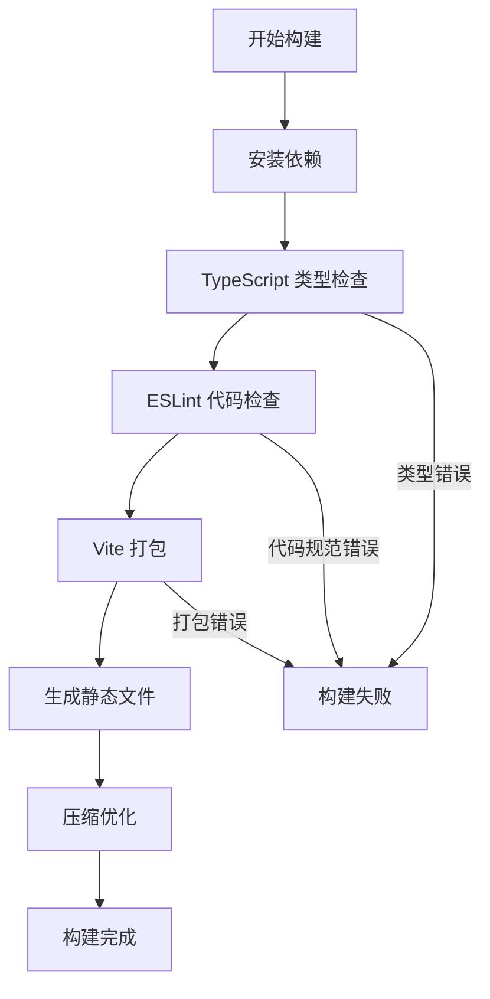
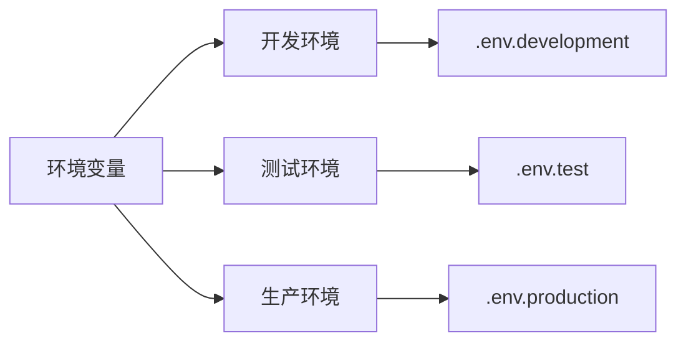
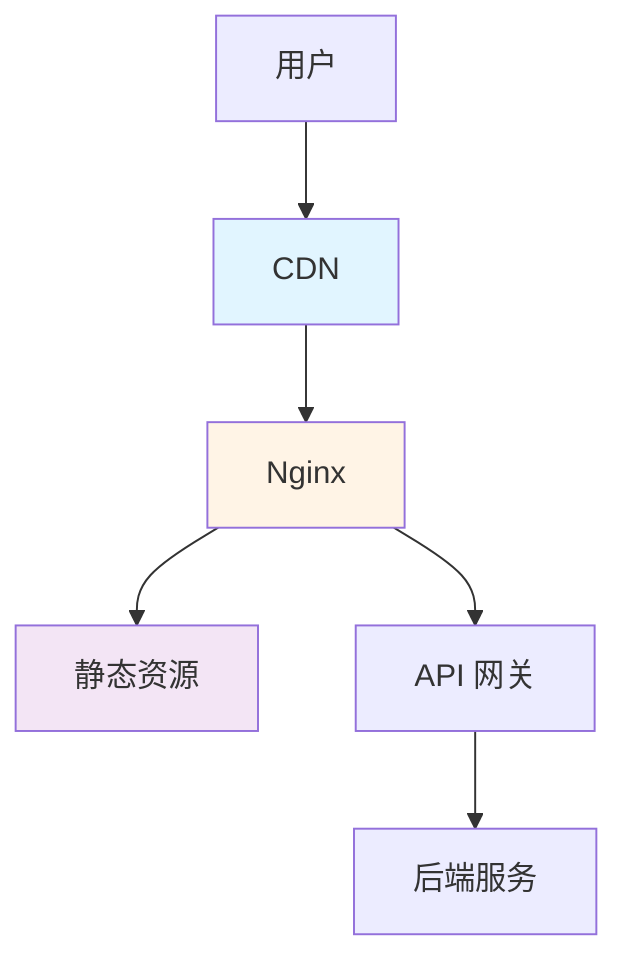
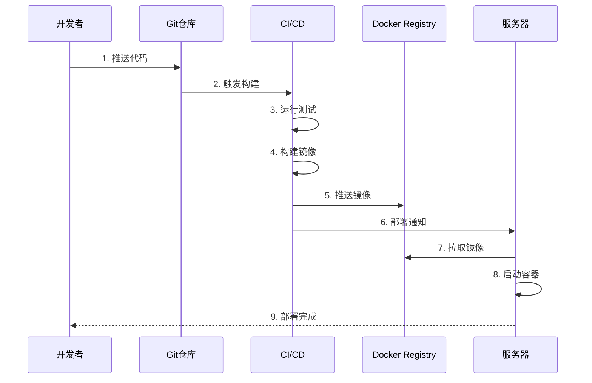
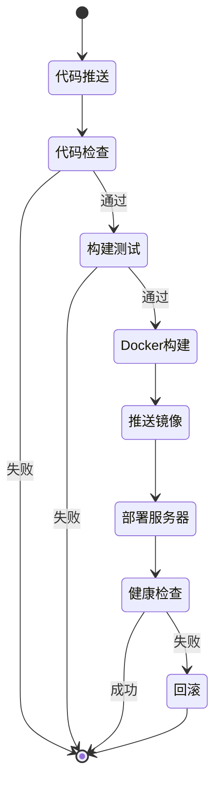
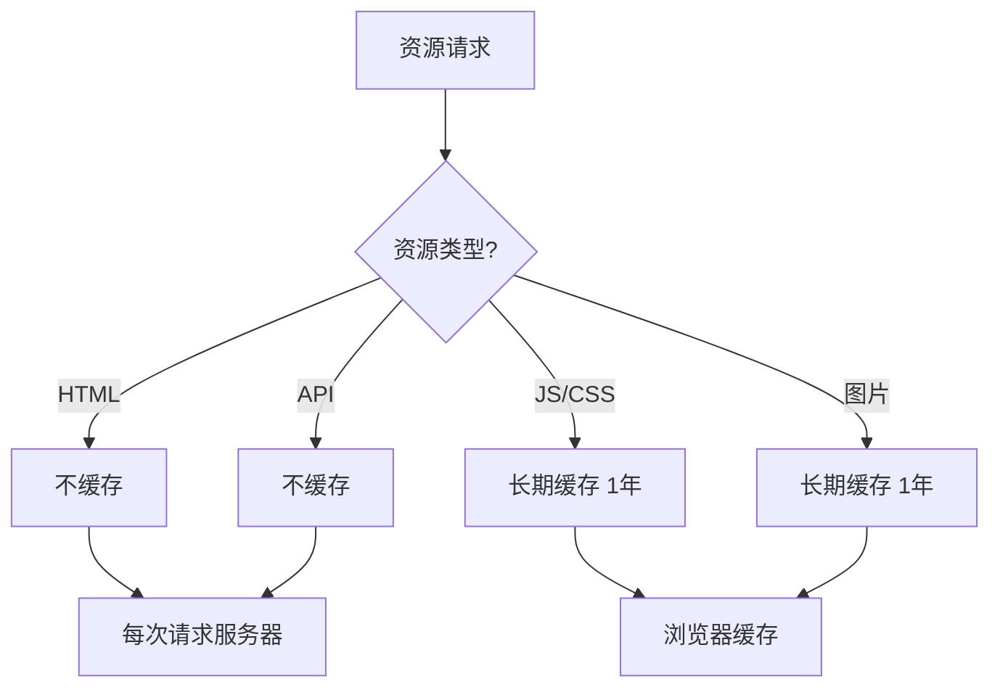
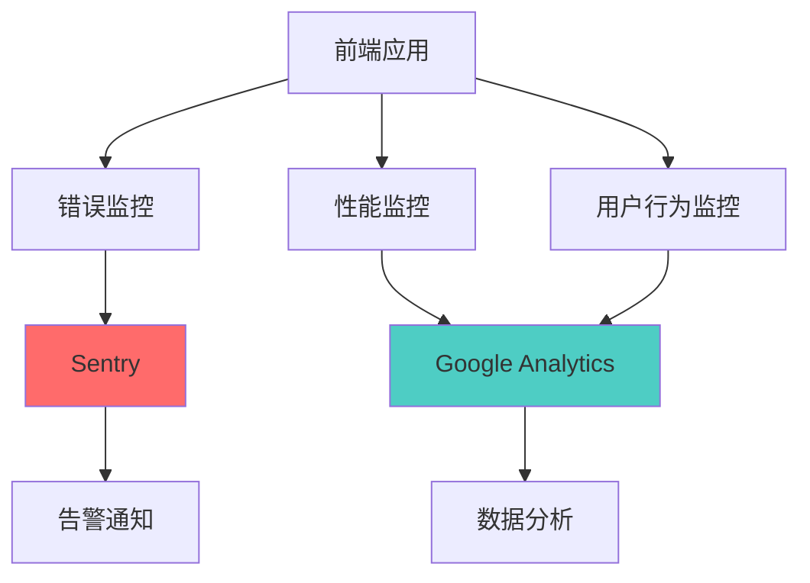

# 部署指南

## 📋 目录

- [1. 构建流程](#1-构建流程)
- [2. 环境配置](#2-环境配置)
- [3. 部署方案](#3-部署方案)
- [4. CI/CD 配置](#4-cicd-配置)
- [5. 性能优化](#5-性能优化)
- [6. 监控与日志](#6-监控与日志)

---

## 1. 构建流程

### 1.1 构建流程图



### 1.2 构建命令

```bash
# 1. 安装依赖
npm install

# 2. 类型检查
npm run build  # 包含 tsc -b

# 3. 代码检查
npm run lint

# 4. 格式检查
npm run format:check

# 5. 生成 API 代码（如果需要）
npm run api

# 6. 构建生产版本
npm run build

# 7. 预览构建结果
npm run preview
```

### 1.3 构建产物

```
dist/
├── index.html              # 入口 HTML
├── assets/
│   ├── index-[hash].js    # 主 JS 文件
│   ├── index-[hash].css   # 主 CSS 文件
│   └── vendor-[hash].js   # 第三方库
└── favicon.ico            # 网站图标
```

### 1.4 构建配置

**文件位置：** `vite.config.ts`

```typescript
import { defineConfig } from 'vite'
import react, { reactCompilerPreset } from '@vitejs/plugin-react'
import babel from '@rolldown/plugin-babel'
import path from 'path'

export default defineConfig({
  plugins: [
    react(),
    babel({ presets: [reactCompilerPreset()] })
  ],
  resolve: {
    alias: {
      '@': path.resolve(__dirname, './src'),
    },
  },
  build: {
    outDir: 'dist',                    // 输出目录
    sourcemap: false,                  // 生产环境不生成 sourcemap
    minify: 'terser',                  // 使用 terser 压缩
    chunkSizeWarningLimit: 1000,       // chunk 大小警告限制
    rollupOptions: {
      output: {
        manualChunks: {
          'react-vendor': ['react', 'react-dom', 'react-router-dom'],
          'antd-vendor': ['antd'],
          'utils-vendor': ['axios', 'zustand'],
        },
      },
    },
  },
})
```

---

## 2. 环境配置

### 2.1 环境变量



### 2.2 环境文件

**开发环境：** `.env.development`

```bash
# API 地址
VITE_API_BASE_URL=http://localhost:8123/api

# 应用标题
VITE_APP_TITLE=Code Create - 开发环境

# 是否启用 Mock
VITE_USE_MOCK=false

# 日志级别
VITE_LOG_LEVEL=debug
```

**测试环境：** `.env.test`

```bash
# API 地址
VITE_API_BASE_URL=https://test-api.codecreate.com/api

# 应用标题
VITE_APP_TITLE=Code Create - 测试环境

# 是否启用 Mock
VITE_USE_MOCK=false

# 日志级别
VITE_LOG_LEVEL=info
```

**生产环境：** `.env.production`

```bash
# API 地址
VITE_API_BASE_URL=https://api.codecreate.com/api

# 应用标题
VITE_APP_TITLE=Code Create

# 是否启用 Mock
VITE_USE_MOCK=false

# 日志级别
VITE_LOG_LEVEL=error
```

### 2.3 环境变量使用

```typescript
// 在代码中使用
const apiBaseUrl = import.meta.env.VITE_API_BASE_URL
const appTitle = import.meta.env.VITE_APP_TITLE

// 类型定义
interface ImportMetaEnv {
  readonly VITE_API_BASE_URL: string
  readonly VITE_APP_TITLE: string
  readonly VITE_USE_MOCK: string
  readonly VITE_LOG_LEVEL: string
}

interface ImportMeta {
  readonly env: ImportMetaEnv
}
```

---

## 3. 部署方案

### 3.1 部署架构



### 3.2 Nginx 配置

**文件位置：** `nginx.conf`

```nginx
server {
    listen 80;
    server_name codecreate.com;
    
    # 重定向到 HTTPS
    return 301 https://$server_name$request_uri;
}

server {
    listen 443 ssl http2;
    server_name codecreate.com;
    
    # SSL 证书
    ssl_certificate /etc/nginx/ssl/codecreate.crt;
    ssl_certificate_key /etc/nginx/ssl/codecreate.key;
    
    # 根目录
    root /var/www/codecreate/dist;
    index index.html;
    
    # Gzip 压缩
    gzip on;
    gzip_types text/plain text/css application/json application/javascript text/xml application/xml application/xml+rss text/javascript;
    gzip_min_length 1000;
    
    # 静态资源缓存
    location ~* \.(js|css|png|jpg|jpeg|gif|ico|svg|woff|woff2|ttf|eot)$ {
        expires 1y;
        add_header Cache-Control "public, immutable";
    }
    
    # HTML 文件不缓存
    location ~* \.html$ {
        expires -1;
        add_header Cache-Control "no-cache, no-store, must-revalidate";
    }
    
    # API 代理
    location /api/ {
        proxy_pass http://backend:8123/api/;
        proxy_set_header Host $host;
        proxy_set_header X-Real-IP $remote_addr;
        proxy_set_header X-Forwarded-For $proxy_add_x_forwarded_for;
        proxy_set_header X-Forwarded-Proto $scheme;
    }
    
    # SPA 路由支持
    location / {
        try_files $uri $uri/ /index.html;
    }
}
```

### 3.3 Docker 部署

**Dockerfile**

```dockerfile
# 构建阶段
FROM node:20-alpine AS builder

WORKDIR /app

# 复制依赖文件
COPY package*.json ./

# 安装依赖
RUN npm ci

# 复制源码
COPY . .

# 构建
RUN npm run build

# 生产阶段
FROM nginx:alpine

# 复制构建产物
COPY --from=builder /app/dist /usr/share/nginx/html

# 复制 Nginx 配置
COPY nginx.conf /etc/nginx/conf.d/default.conf

# 暴露端口
EXPOSE 80

# 启动 Nginx
CMD ["nginx", "-g", "daemon off;"]
```

**docker-compose.yml**

```yaml
version: '3.8'

services:
  frontend:
    build:
      context: .
      dockerfile: Dockerfile
    ports:
      - "80:80"
      - "443:443"
    volumes:
      - ./nginx.conf:/etc/nginx/conf.d/default.conf
      - ./ssl:/etc/nginx/ssl
    environment:
      - NODE_ENV=production
    restart: unless-stopped
    networks:
      - app-network

networks:
  app-network:
    driver: bridge
```

### 3.4 部署步骤



---

## 4. CI/CD 配置

### 4.1 GitHub Actions

**文件位置：** `.github/workflows/deploy.yml`

```yaml
name: Deploy to Production

on:
  push:
    branches:
      - main

jobs:
  build-and-deploy:
    runs-on: ubuntu-latest
    
    steps:
      # 1. 检出代码
      - name: Checkout code
        uses: actions/checkout@v4
      
      # 2. 设置 Node.js
      - name: Setup Node.js
        uses: actions/setup-node@v4
        with:
          node-version: '20'
          cache: 'npm'
      
      # 3. 安装依赖
      - name: Install dependencies
        run: npm ci
      
      # 4. 代码检查
      - name: Lint code
        run: npm run lint
      
      # 5. 格式检查
      - name: Check format
        run: npm run format:check
      
      # 6. 构建
      - name: Build
        run: npm run build
        env:
          VITE_API_BASE_URL: ${{ secrets.API_BASE_URL }}
      
      # 7. 构建 Docker 镜像
      - name: Build Docker image
        run: |
          docker build -t codecreate-frontend:${{ github.sha }} .
          docker tag codecreate-frontend:${{ github.sha }} codecreate-frontend:latest
      
      # 8. 登录 Docker Registry
      - name: Login to Docker Registry
        uses: docker/login-action@v3
        with:
          registry: ${{ secrets.DOCKER_REGISTRY }}
          username: ${{ secrets.DOCKER_USERNAME }}
          password: ${{ secrets.DOCKER_PASSWORD }}
      
      # 9. 推送镜像
      - name: Push Docker image
        run: |
          docker push codecreate-frontend:${{ github.sha }}
          docker push codecreate-frontend:latest
      
      # 10. 部署到服务器
      - name: Deploy to server
        uses: appleboy/ssh-action@v1.0.0
        with:
          host: ${{ secrets.SERVER_HOST }}
          username: ${{ secrets.SERVER_USER }}
          key: ${{ secrets.SERVER_SSH_KEY }}
          script: |
            cd /opt/codecreate
            docker-compose pull frontend
            docker-compose up -d frontend
            docker image prune -f
```

### 4.2 GitLab CI

**文件位置：** `.gitlab-ci.yml`

```yaml
stages:
  - test
  - build
  - deploy

variables:
  DOCKER_IMAGE: $CI_REGISTRY_IMAGE:$CI_COMMIT_SHA

# 测试阶段
test:
  stage: test
  image: node:20-alpine
  cache:
    paths:
      - node_modules/
  script:
    - npm ci
    - npm run lint
    - npm run format:check
  only:
    - main
    - develop

# 构建阶段
build:
  stage: build
  image: docker:latest
  services:
    - docker:dind
  script:
    - docker build -t $DOCKER_IMAGE .
    - docker tag $DOCKER_IMAGE $CI_REGISTRY_IMAGE:latest
    - docker login -u $CI_REGISTRY_USER -p $CI_REGISTRY_PASSWORD $CI_REGISTRY
    - docker push $DOCKER_IMAGE
    - docker push $CI_REGISTRY_IMAGE:latest
  only:
    - main

# 部署阶段
deploy:
  stage: deploy
  image: alpine:latest
  before_script:
    - apk add --no-cache openssh-client
    - eval $(ssh-agent -s)
    - echo "$SSH_PRIVATE_KEY" | tr -d '\r' | ssh-add -
    - mkdir -p ~/.ssh
    - chmod 700 ~/.ssh
  script:
    - ssh -o StrictHostKeyChecking=no $SERVER_USER@$SERVER_HOST "
        cd /opt/codecreate &&
        docker-compose pull frontend &&
        docker-compose up -d frontend &&
        docker image prune -f
      "
  only:
    - main
  when: manual
```

### 4.3 CI/CD 流程



---

## 5. 性能优化

### 5.1 构建优化

```typescript
// vite.config.ts
export default defineConfig({
  build: {
    // 1. 代码分割
    rollupOptions: {
      output: {
        manualChunks: {
          'react-vendor': ['react', 'react-dom', 'react-router-dom'],
          'antd-vendor': ['antd'],
          'utils-vendor': ['axios', 'zustand'],
        },
      },
    },
    
    // 2. 压缩配置
    minify: 'terser',
    terserOptions: {
      compress: {
        drop_console: true,      // 删除 console
        drop_debugger: true,     // 删除 debugger
      },
    },
    
    // 3. CSS 代码分割
    cssCodeSplit: true,
    
    // 4. 资源内联限制
    assetsInlineLimit: 4096,     // 小于 4kb 的资源内联
  },
})
```

### 5.2 运行时优化

```typescript
// 1. 路由懒加载
const Home = lazy(() => import('@/pages/Home'))
const About = lazy(() => import('@/pages/About'))

// 2. 组件懒加载
const HeavyComponent = lazy(() => import('@/components/HeavyComponent'))

// 3. 图片懒加载


// 4. 使用 React.memo
const MemoizedComponent = React.memo(({ data }) => {
  return <div>{data}</div>
})

// 5. 使用 useMemo 和 useCallback
const sortedData = useMemo(() => {
  return data.sort((a, b) => a.value - b.value)
}, [data])

const handleClick = useCallback(() => {
  console.log('clicked')
}, [])
```

### 5.3 缓存策略



### 5.4 性能监控

```typescript
// 性能监控
if ('performance' in window) {
  window.addEventListener('load', () => {
    const perfData = window.performance.timing
    const pageLoadTime = perfData.loadEventEnd - perfData.navigationStart
    const connectTime = perfData.responseEnd - perfData.requestStart
    const renderTime = perfData.domComplete - perfData.domLoading
    
    console.log('页面加载时间:', pageLoadTime)
    console.log('请求响应时间:', connectTime)
    console.log('页面渲染时间:', renderTime)
    
    // 上报到监控系统
    reportPerformance({
      pageLoadTime,
      connectTime,
      renderTime,
    })
  })
}
```

---

## 6. 监控与日志

### 6.1 监控架构



### 6.2 错误监控

```typescript
// 集成 Sentry
import * as Sentry from '@sentry/react'

Sentry.init({
  dsn: 'YOUR_SENTRY_DSN',
  environment: import.meta.env.MODE,
  integrations: [
    new Sentry.BrowserTracing(),
    new Sentry.Replay(),
  ],
  tracesSampleRate: 1.0,
  replaysSessionSampleRate: 0.1,
  replaysOnErrorSampleRate: 1.0,
})

// 捕获错误
try {
  // 业务代码
} catch (error) {
  Sentry.captureException(error)
}
```

### 6.3 日志系统

```typescript
// 日志工具
class Logger {
  private level: string
  
  constructor() {
    this.level = import.meta.env.VITE_LOG_LEVEL || 'info'
  }
  
  debug(message: string, ...args: any[]) {
    if (this.shouldLog('debug')) {
      console.debug(`[DEBUG] ${message}`, ...args)
    }
  }
  
  info(message: string, ...args: any[]) {
    if (this.shouldLog('info')) {
      console.info(`[INFO] ${message}`, ...args)
    }
  }
  
  warn(message: string, ...args: any[]) {
    if (this.shouldLog('warn')) {
      console.warn(`[WARN] ${message}`, ...args)
    }
  }
  
  error(message: string, ...args: any[]) {
    if (this.shouldLog('error')) {
      console.error(`[ERROR] ${message}`, ...args)
      // 上报到监控系统
      this.report('error', message, args)
    }
  }
  
  private shouldLog(level: string): boolean {
    const levels = ['debug', 'info', 'warn', 'error']
    return levels.indexOf(level) >= levels.indexOf(this.level)
  }
  
  private report(level: string, message: string, args: any[]) {
    // 上报到监控系统
    fetch('/api/logs', {
      method: 'POST',
      headers: { 'Content-Type': 'application/json' },
      body: JSON.stringify({ level, message, args, timestamp: Date.now() }),
    })
  }
}

export const logger = new Logger()
```

### 6.4 健康检查

```typescript
// 健康检查端点
export async function healthCheck() {
  try {
    const response = await fetch('/api/health')
    return response.ok
  } catch (error) {
    logger.error('Health check failed', error)
    return false
  }
}

// 定期检查
setInterval(async () => {
  const isHealthy = await healthCheck()
  if (!isHealthy) {
    logger.error('Application is unhealthy')
    // 触发告警
  }
}, 60000) // 每分钟检查一次
```

---

## 7. 常见问题

### Q1: 构建失败怎么办？

```bash
# 1. 清理缓存
rm -rf node_modules package-lock.json
npm install

# 2. 检查 Node 版本
node -v  # 应该是 20.x

# 3. 检查 TypeScript 错误
npm run build

# 4. 检查 ESLint 错误
npm run lint
```

### Q2: 如何回滚部署？

```bash
# 1. 查看历史版本
docker images codecreate-frontend

# 2. 回滚到指定版本
docker-compose down
docker tag codecreate-frontend:previous codecreate-frontend:latest
docker-compose up -d

# 3. 验证回滚
curl http://localhost/api/health
```

### Q3: 如何优化首屏加载速度？

1. 使用路由懒加载
2. 开启 Gzip 压缩
3. 使用 CDN 加速
4. 优化图片资源
5. 减少第三方库体积

### Q4: 如何配置多环境部署？

```bash
# 开发环境
npm run build -- --mode development

# 测试环境
npm run build -- --mode test

# 生产环境
npm run build -- --mode production
```

---

## 8. 部署检查清单

### 8.1 构建前检查

- [ ] 代码已提交到 Git
- [ ] 所有测试通过
- [ ] ESLint 检查通过
- [ ] TypeScript 类型检查通过
- [ ] 环境变量配置正确

### 8.2 部署后检查

- [ ] 应用可以正常访问
- [ ] API 请求正常
- [ ] 路由跳转正常
- [ ] 静态资源加载正常
- [ ] 错误监控正常上报
- [ ] 性能指标符合预期

### 8.3 安全检查

- [ ] HTTPS 配置正确
- [ ] 敏感信息已移除
- [ ] CORS 配置正确
- [ ] CSP 策略配置
- [ ] 依赖包无安全漏洞

---

## 9. 总结

本部署指南涵盖了从构建到上线的完整流程：

✅ **自动化构建** - Vite 快速构建  
✅ **环境隔离** - 多环境配置管理  
✅ **容器化部署** - Docker 标准化部署  
✅ **CI/CD 集成** - 自动化部署流程  
✅ **性能优化** - 多维度性能提升  
✅ **监控告警** - 完善的监控体系  

遵循本指南可以实现高效、稳定的生产部署。
